# Container Diagram (C4 Level 2)

Cumulative diagram, extended one service at a time as each passes through the Architecture Agent. See [service-boundaries.md](service-boundaries.md) for the tabular dependency detail behind each edge.

```mermaid
graph TB
    Client[kart-web<br/>Customer-facing Angular app]
    GW[API Gateway]
    Client --> GW

    GW --> Offer[kart-offer-service<br/>Coupon + Pricing + Promotion]
    GW --> Review[kart-review-service<br/>Review + Rating + Moderation]
    GW --> Cart[kart-cart-service<br/>Cart lifecycle + merge + expiry]
    GW --> Inventory[kart-inventory-service<br/>Stock + Reservations + Warehouses]
    GW --> Recommendation[kart-recommendation-service<br/>Personalization / recommendations]
    GW --> Admin[kart-admin-service<br/>Back-office RBAC + orchestration]
    GW --> DeliveryTracking[kart-delivery-tracking-service<br/>Carrier tracking + ETA]
    GW --> Category[kart-category-service<br/>Taxonomy + hierarchy + navigation]
    GW --> Wishlist[kart-wishlist-service<br/>Saved items + Price-Drop Alerts]
    GW -->|"sync REST: POST /orders, GET /orders/{id}, POST /orders/{id}/cancel"| Order
    Support[kart-admin-web<br/>Support Agent / Admin Angular app] --> GW
    GW -->|"sync REST: POST /payments/charge (secondary path — see below), POST /payments/{id}/refund (support-agent driven, BRD §22)"| Payment

    Order[kart-order-service<br/>Order lifecycle + Saga orchestrator]
    Product[Product Service] -. ProductPriceChanged .-> Offer
    Order -. OrderCancelled .-> Offer
    Offer -. CouponRedeemed .-> Order
    Offer -. CouponRedeemed .-> Analytics[kart-analytics-service<br/>Event ingestion + dashboards/funnels]
    Offer -. PriceQuoteIssued .-> Analytics
    Offer -. PromotionActivated .-> Analytics
    Offer -. PromotionDeactivated .-> Analytics
    Product -. ProductCreated .-> Analytics
    Product -. ProductPriceChanged .-> Analytics
    Product -. ProductUpdated .-> Analytics
    Product -. ProductPriceChanged .-> Wishlist
    Product -. ProductDiscontinued .-> Wishlist
    Wishlist -->|"sync, GET /products/{id}, hourly reconciliation job only — not on the /wishlist request path"| Product

    Order -. OrderDelivered .-> Recommendation
    Product -. ProductCreated .-> Recommendation
    ClickstreamSource[Client Event Ingestion Gateway<br/>infra, not a bounded-context service] -. "ProductViewed / ProductClicked / SearchPerformed (Kafka, kart.recommendation.clickstream-events)" .-> Recommendation
    ClickstreamSource -. "same topic, full fan-in (ADR-0004)" .-> Analytics
    Recommendation -->|"sync, GET /inventory/{sku}, fails open on timeout"| Inventory
    Recommendation -->|"sync, GET /products/{id}, fails open on timeout"| Product

    Order -. OrderDelivered .-> Review
    Review -. ReviewSubmitted .-> Product
    Review -. ReviewSubmitted .-> Analytics
    Review -. ReviewUpdated .-> Product
    Review -. ReviewUpdated .-> Analytics
    Classifier[Content-Safety Classifier<br/>external, non-platform] -. sync pre-check .-> Review

    Inventory -. InventoryReservationFailed .-> Cart
    Cart -. CartCheckedOut .-> Analytics
    Cart -->|gRPC, lazy validation, fails open| Product
    Cart -->|gRPC, lazy validation, fails open| Inventory

    Order -->|"POST /inventory/reserve, /release (sync)"| Inventory
    Order -. OrderCancelled .-> Inventory
    Order -. OrderCompensationTriggered .-> Inventory
    Inventory -. InventoryReserved .-> Order
    Inventory -. InventoryReservationFailed .-> Order
    Inventory -. InventoryReleased .-> Order
    Inventory -. InventoryReleased .-> Analytics
    Inventory -. InventoryReplenished .-> Analytics

    Payment[kart-payment-service<br/>Payment intents + Charge + Refund + Chargeback]
    PaymentGW[Payment Gateway<br/>external, tokenized card processing]
    Order -. OrderCreated .-> Payment
    Order -->|"sync, POST /payments/{id}/refund (saga-compensation trigger, direct call not gateway-proxied)"| Payment
    Payment -->|"sync, tokenized charge/refund call, circuit breaker"| PaymentGW
    PaymentGW -.->|"async webhook, POST /payments/webhooks/{gateway}"| Payment
    Payment -. PaymentCompleted .-> Order
    Payment -. PaymentFailed .-> Order
    Payment -. RefundIssued .-> Order
    Payment -. ChargebackReceived .-> Order
    Payment -. "PaymentCompleted/Failed, RefundIssued, ChargebackReceived" .-> Analytics
    Shipping[kart-shipping-service<br/>Carrier Selection + Label Generation]
    Carriers[Shipping Carriers<br/>external, not a Kart service]
    Order -. OrderConfirmed .-> Shipping
    Shipping -. ShipmentDispatched .-> Order
    Shipping -. ShipmentDispatched .-> DeliveryTracking
    Shipping -. ShipmentDispatched .-> Analytics
    Shipping -. ShipmentCreationFailed .-> Order
    Shipping -. ShipmentCreationFailed .-> Analytics
    Shipping -->|"sync REST, rate/label generation, circuit breaker + secondary-carrier failover"| Carriers
    CarrierWebhook[Carrier webhook senders<br/>external, per-carrier, not a Kart service] -.->|"async, per-carrier HTTP push, HMAC-verified"| DeliveryTracking
    DeliveryTracking -->|"sync, per-carrier polling fallback, 6h staleness threshold, circuit breaker + bulkhead"| CarrierAPI[Carrier tracking APIs<br/>external, per-carrier, not a Kart service]
    DeliveryTracking -. "DeliveryStatusUpdated (terminal delivered status only)" .-> Order
    DeliveryTracking -. DeliveryStatusUpdated .-> Analytics
    Identity[kart-identity-service<br/>AuthN + Tokens + Sessions + MFA + RBAC + SSO]
    UserSvc[User Service]
    Notification[kart-notification-service<br/>Email/SMS/Push fan-out, consumer-only]
    EnterpriseIdP[Enterprise IdP<br/>Okta / Azure AD / Google Workspace, external]
    SocialIdP[Social IdP<br/>Google / Apple, external]

    GW -->|"sync REST: /auth/login, /auth/refresh, /auth/logout, /auth/mfa/verify, /auth/password/reset-initiate, /auth/password/reset-confirm"| Identity
    GW -->|"sync, cached JWKS public-key retrieval, not a per-request call"| Identity
    Identity -->|"sync, SAML AuthnRequest / OIDC authorization request, per-IdP bulkhead"| EnterpriseIdP
    EnterpriseIdP -.->|"sync, inline browser redirect: SAML ACS / OIDC callback"| Identity
    Identity -->|"sync, OIDC authorization request, own bulkhead group"| SocialIdP
    SocialIdP -.->|"sync, inline browser redirect: OIDC callback, resolves to Customer role only"| Identity
    Identity -. UserRegistered .-> UserSvc
    Identity -. UserRegistered .-> Analytics
    Identity -. SessionCreated .-> Analytics
    Identity -. UserAccountUpdated .-> UserSvc

    Category -. CategoryUpdated .-> Analytics

    InternalBI[Internal BI/ops/dashboard consumers<br/>not via public Gateway] -->|"sync, internal REST query API (/internal/v1/...) + BI-tool warehouse connection"| Analytics

    AI[kart-ai-assistant-service<br/>NL→intent · orchestration · audit]
    LLMGateway[Model Gateway / LLM Provider<br/>external, provider-agnostic]
    GW -->|"sync REST, POST /v1/ai-assistant/query, bearerAuth: ai-assistant.query (ADR-0025)"| AI
    AI -->|"sync, OAuth2 client-credentials, analytics.dashboards.read"| Analytics
    AI -->|"sync, structured-output 'plan' call + grounded 'explain' call"| LLMGateway

    SA["kart-shopping-assistant-service<br/>NL→intent · Customer-facing · mutates orders/cart/coupons"]
    Search["kart-search-service<br/>Full-text search + facets + ranking (node added by this pass — see caption)"]
    GW -->|"Tier 1 role-exclusion: reject Admin/Support Agent/Partner API only — Customer and anonymous both pass; POST /v1/shopping-assistant/query, bearerAuth: shopping-assistant.act or anonymous (ADR-0029)"| SA
    SA -->|"sync, GET /orders/{id}, POST /orders/{id}/cancel, POST /orders (checkout-create — chains into Order's own Inventory-reserve leg, ADR-0009), per-edge circuit breaker"| Order
    SA -->|"sync, GET /cart, POST /cart/items, POST /cart/checkout, per-edge circuit breaker"| Cart
    SA -->|"sync, POST /coupons/validate, GET /promotions/active, per-edge circuit breaker"| Offer
    SA -->|"sync, GET /search, per-edge circuit breaker"| Search
    SA -->|"sync, GET /products/{sku}, per-edge circuit breaker"| Product
    SA -->|"sync, GET /recommendations/{userId}, per-edge circuit breaker"| Recommendation
    SA -->|"sync, GET /users/{id}, per-edge circuit breaker"| UserSvc
    SA -->|"sync, GET /tracking/{trackingId}, per-edge circuit breaker"| DeliveryTracking
    SA -->|"sync, /wishlist add/move-to-cart, per-edge circuit breaker"| Wishlist
    SA -->|"sync, structured-output plan/confirm/summarize calls, capability-tier request, no vendor named"| LLMGateway

    Admin -->|"sync REST, catalog management"| Product
    Admin -->|"sync REST, catalog management"| Category
    Admin -->|"sync REST, coupon issuance, POST /coupons"| Offer
    Admin -->|"sync REST, user suspension, lock/unlock"| Identity
    Admin -->|"sync REST, inventory replenishment"| Inventory
    Admin -->|"sync REST, POST /orders/{id}/resolve-fulfillment-exception"| Order
    Admin -. AdminActionPerformed .-> Analytics

    Order -. "OrderCreated/Confirmed/Cancelled/CompensationTriggered/Delivered" .-> Notification
    Payment -. "PaymentCompleted/Failed, RefundIssued, ChargebackReceived" .-> Notification
    Shipping -. ShipmentDispatched .-> Notification
    Shipping -. ShipmentCreationFailed .-> Notification
    DeliveryTracking -. DeliveryStatusUpdated .-> Notification
    Wishlist -. WishlistPriceAlertTriggered .-> Notification
    Wishlist -. WishlistPriceAlertTriggered .-> Analytics
    Identity -. UserRegistered .-> Notification
    UserSvc -. UserNotificationPreferenceUpdated .-> Notification
    UserSvc -. UserDataErased .-> Analytics
    UserSvc -. UserDataErased .-> Wishlist
    UserSvc -. UserDataErased .-> Cart
    Notification -. NotificationSent .-> Analytics
```

_Placed so far: `kart-offer-service`, `kart-review-service`, `kart-cart-service`, `kart-notification-service`, `kart-inventory-service`, `kart-recommendation-service`, `kart-admin-service`, `kart-payment-service`, `kart-category-service`, `kart-shipping-service`, `kart-delivery-tracking-service`, `kart-product-service`, `kart-wishlist-service`, `kart-identity-service`, `kart-user-service`, `kart-search-service`, `kart-analytics-service`, `kart-order-service`, `kart-ai-assistant-service`, and now `kart-shopping-assistant-service` (this pass) — a brand-new, mutation-capable capability, not a gap-fill on an existing service ([ADR-0028](../adr/0028-shopping-assistant-service-scope-and-integration.md)), added as a single new node (`SA`) with nine synchronous edges (`Order`, `Cart`, `Offer`, `Search`, `Product`, `Recommendation`, `UserSvc`, `DeliveryTracking`, `Wishlist` — each independently circuit-breakered, see `kart-shopping-assistant-service/architecture.md`) and one synchronous edge to an external, non-Kart system (`LLMGateway`). No edge of any kind exists from `SA` to `Payment` — deliberately excluded per ADR-0028. This diagram is now complete for all 20 deployable service repos. Note: the `Search` node is added here for the first time as part of this pass, purely to anchor `SA`'s own new edge to it — `kart-search-service` has its own approved `architecture.md` with a fully resolved dependency graph, but that service's own Architecture Agent pass never appended a node/entry into this diagram or `service-boundaries.md`; this is a pre-existing gap in the platform's cumulative architecture memory, flagged here, not backfilled, since fully placing `kart-search-service` (and `kart-user-service`, whose bare `UserSvc` node already existed from other services' event edges and is reused unchanged here) is outside the scope of a `kart-shopping-assistant-service`-targeted run. `CarrierWebhook`/`CarrierAPI` are external, non-Kart systems (per-carrier third parties), not bounded contexts of this platform — shown only because they are Delivery Tracking's largest integration surface._
