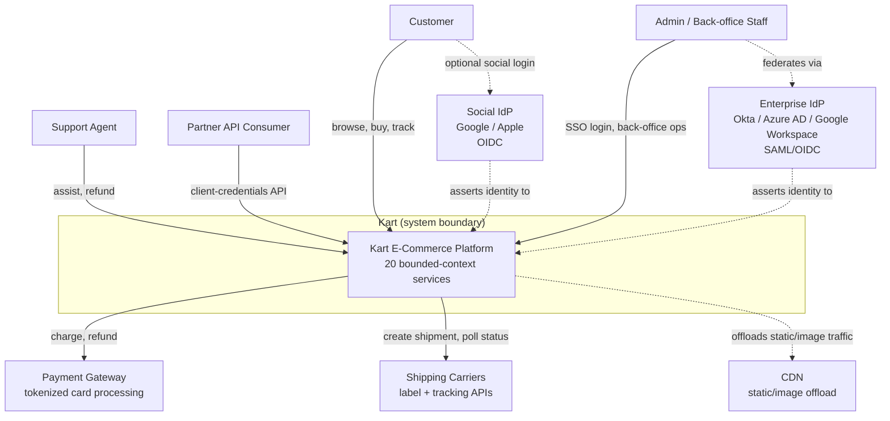

# System Context (C4 Level 1)

Kart as a single system box, its human actors, and the external systems it depends on. This is the level above [container-diagram.md](container-diagram.md) (C4 Level 2, which decomposes the box below into individual services) — see that file for the per-service breakdown and [service-boundaries.md](service-boundaries.md) for the tabular dependency detail.

_Service count now 20: `kart-ai-assistant-service` (the platform's 19th deployable repo, [ADR-0024](../adr/0024-ai-assistant-service-scope-and-integration.md)) — a purely internal, back-office capability surfaced inside `kart-admin-web` and reached only by the existing `Support Agent`/`Admin` actors — plus, as of this pass, `kart-shopping-assistant-service` (the platform's **20th** deployable repo, [ADR-0028](../adr/0028-shopping-assistant-service-scope-and-integration.md)) — a `Customer`-facing, mutation-capable capability surfaced inside `kart-web`, reached by the existing `Customer` actor (both authenticated and, for its read-only intents, anonymous/guest, per [ADR-0029](../adr/0029-shopping-assistant-scope-and-guest-access.md)). Neither addition introduces a new actor or a new external system at this level — both route through the existing API Gateway box like every other service, and the Model Gateway/LLM provider each of them calls is an internal integration detail one level down, not a system-context-level external dependency (the same treatment `PaymentGW`/`Carriers` get, and the LLM provider does not, since — unlike a payment processor or a carrier — it is invoked from inside the system boundary as an implementation detail of two specific services, not as a boundary Kart itself transacts across at this level). The prior version of this caption stated the count as "21" while only 19 services had actually been placed at that point in the graph — a pre-existing arithmetic inconsistency corrected here alongside this pass's own addition, not introduced by it. See [container-diagram.md](container-diagram.md) and [service-boundaries.md](service-boundaries.md) for both services' component-level detail._

## Actors

|Actor|Relationship to Kart|
|---|---|
|Customer|Browses catalog, manages cart/orders/wishlist; authenticates natively or via social SSO ([kart-requirements.md §24.2](../requirements/kart-requirements.md))|
|Support Agent|Assists customers within a capped RBAC grant ([kart-requirements.md §24.1](../requirements/kart-requirements.md))|
|Admin / Back-office Staff|Full back-office operations, authenticates via enterprise SSO federation|
|Partner API Consumer|Non-interactive, scoped client-credentials access (e.g., bulk catalog upload)|

## Client Applications

The `Customer` and `Support Agent`/`Admin` actors above reach Kart through two separate Angular applications, not a generic "web client" — see [`docs/client/README.md`](../client/README.md) for the full app-split rationale and each app's design record:

- **`kart-web`** — public storefront, serves `Customer`. Public/anonymous-heavy, SSR, PWA, the BRD §3 load ceiling.
- **`kart-admin-web`** — internal back-office console, serves `Support Agent` and `Admin`. Authenticated-only, no SSR/SEO need, lower traffic.

`Partner API Consumer` is non-interactive and has no client application — it calls `kart-api-gateway` directly via client-credentials.

## External Systems

|System|Why It's Outside the Boundary|
|---|---|
|Enterprise IdP|Owned by the org's IT, not Kart — Identity Service federates against it rather than reimplementing corporate auth|
|Social IdP|Third-party identity provider; Kart only ever sees the exchanged OIDC token, never the provider's user store|
|Payment Gateway|PCI scope reduction — card data is tokenized at the gateway, never stored inside Kart (BRD §5.3 Boundary Rationale)|
|Shipping Carriers|Physical fulfillment is executed by external carriers; Kart only requests labels and polls status|
|CDN|Static/image asset delivery is offloaded so origin traffic reflects only dynamic, business-logic requests (BRD §4.4)|

_Everything inside the "Kart" box is decomposed one level down in [container-diagram.md](container-diagram.md), which grows service-by-service as each passes through the Architecture Agent._
