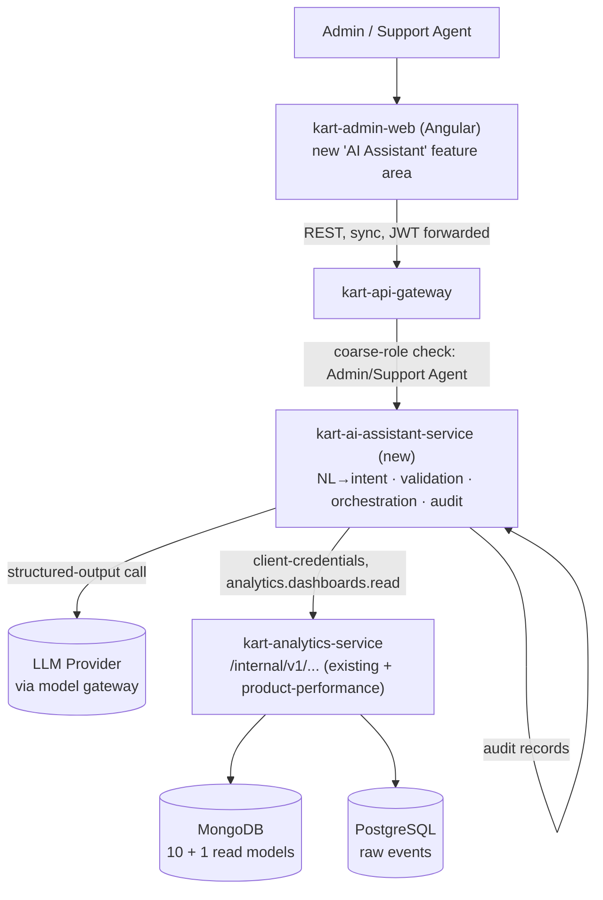
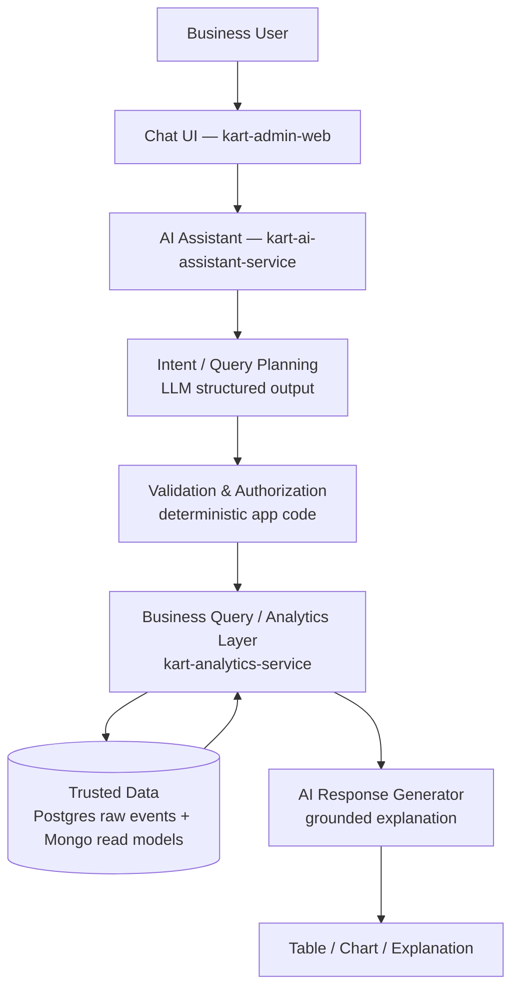

# Kart Business Assistant — Requirements & Design Specification

## 0. Reading Guide

This document specifies a **new product capability**: a natural-language, business-facing Generative AI assistant that lets Admin/Support-Agent users ask questions about Kart's sales, orders, inventory, fulfillment, and marketing data and get back a trustworthy answer, backed by a table/chart, sourced entirely from data Kart already collects.

It does not re-derive Kart's business domain — it reuses the terminology, RBAC model, service boundaries, and data already defined in the BRD (`kart-requirements.md`), the 18-flow catalog (`business-flows.md`), and `kart-analytics-service`'s already-approved design. Every fact in this document that comes from those sources is cited. Every place where those sources are silent, ambiguous, or contradictory is marked **ASSUMPTION** (a default this spec picks so implementation isn't blocked) or **OPEN QUESTION** (something that must be confirmed by a human before or during implementation — see §26).

**Naming:** the capability is referred to throughout as the **Kart Business Assistant**; its backend as **`kart-ai-assistant-service`** (a new bounded context — see §10, §25-D1).

---

## 1. Overview

### 1.1 What is being built

A conversational, natural-language interface — surfaced inside `kart-admin-web` (the existing internal Angular console used by the `Admin` and `Support Agent` roles, per `docs/client/kart-admin-web/requirement-spec.md` §1) — that lets a business user ask a question like *"What are the top 5 selling products in the last 7 days?"* and receive:

- a plain-language answer,
- the trusted data behind that answer (a table),
- where appropriate, a chart,
- an honest signal when the underlying data is still provisional or when the question can't be answered.

The assistant does not talk to a database or an LLM's own knowledge — it talks to `kart-analytics-service`'s existing (and, for a few net-new query types, extended) dashboard/funnel data, the same warehouse that already feeds `kart-admin-web`'s existing "Audit & Compliance" analytics view (`kart-admin-web/requirement-spec.md` §3.5).

### 1.2 Why it is being built

`business-flows.md`'s Flow 18 ("Analytics & Reporting Dashboard (Admin)") already names the destination: `Sales Reports → Inventory Reports → Customer Behavior Analytics → Marketing Campaign Performance → Seller Performance Reports → Export/Schedule Reports → Data Feeds to BI Tools`. Today, that flow is served only by `kart-analytics-service`'s ten fixed dashboard/funnel endpoints (`api-contract.yaml`), each requiring the caller to already know which dashboard to query, with what `from`/`to`/`granularity`, to get an answer — there is no BI tool and no ad-hoc query capability (`kart-analytics-service/architecture.md`: the concrete BI product is explicitly "an infrastructure pick for a later stage, not architecturally load-bearing here"). A business user who wants "top 5 products this week" today has no self-service path at all; they need an engineer to write a query against the warehouse.

The Business Assistant closes that gap for the "self-service ad-hoc question" segment of Flow 18, without requiring the platform to first build or select a full BI product.

### 1.3 Who will use it

The two coarse roles the BRD already defines as `kart-admin-web` users (`kart-requirements.md` §24.1.1): **`Admin`** (full back-office) and **`Support Agent`** (capped, customer-facing operations). Both roles already have a login path into `kart-admin-web`; this capability is a new feature area inside that same console, gated by a new scope (§17), not a new application or a new authentication path.

`Customer` and `Partner API` principals are explicitly **out of scope** — this is an internal back-office tool, the same posture `kart-admin-web` already has (`kart-admin-web/requirement-spec.md` §1: "internal, authenticated-only... Support Agent and Admin actors").

### 1.4 What problem it solves

- Business users currently cannot ask an ad-hoc question of Kart's data without engineering help or without already knowing the exact dashboard/endpoint/parameters to call.
- The ten existing dashboards are each single-purpose and parameter-driven (`from`, `to`, `granularity`, at most one `sku`/`category`/`channel` filter) — they do not support ranking ("top N"), cross-period comparison, or natural-language framing.
- This capability adds a **translation layer** (natural language → the canonical structured query already implied by Analytics' own data model) plus a small number of **new aggregate query capabilities** (ranking, geography — see §10.3) that the existing dashboards do not yet expose.

### 1.5 In scope / out of scope

**In scope (this spec):**
- Natural-language Q&A over Kart's existing business/analytics data (sales, revenue, orders, funnel, fulfillment, inventory movement, promotions, user growth, reviews, notification delivery — the ten dashboards already enumerated in `kart-analytics-service/requirement-spec.md` §6 D4a).
- One net-new analytics capability this spec requires to satisfy the example questions in the prompt that founded this capability: **product performance ranking** (top/bottom-N by revenue, units sold, or order count) — see §10.3, §25-D4.
- Conversational follow-up / context-carrying queries (§14).
- Table and chart rendering, chosen by rule, not by free LLM choice (§13).
- RBAC-gated access limited to `Admin`/`Support Agent` (§17).

**Out of scope (this pass — see §2 Non-Goals for the full list):**
- Geographic/location-based analysis ("top area", "sales in Dhaka") — **no dimension for this exists anywhere in the current data model** (§10.3, §26). Flagged, not silently built.
- Seller/vendor performance reporting — Flow 18 names "Seller Performance Reports," but **no Seller/Vendor bounded context, aggregate, or field exists anywhere in the current 18-service architecture** (confirmed: zero occurrences of "seller"/"vendor" in `ubiquitous-language.md`, any `ddd-model.md`, or the BRD's own service list). This is a genuine gap between `business-flows.md` and the implemented architecture — see §26.
- Writing/mutating any business data (the assistant is read-only, full stop — §9, §16).
- Replacing or being a general-purpose chatbot (customer support, product FAQ, order-status lookup for a single customer) — those already have or will have their own flows (Flow 6/9/14) and are not analytics questions.
- Selecting or building a general BI tool — this spec is scoped to the natural-language layer, not a Looker/Metabase-class product (`kart-analytics-service/architecture.md` already defers that pick).

---

## 2. Goals & Non-Goals

### 2.1 Goals

- **G1.** Let an `Admin`/`Support Agent` user get a correct, sourced answer to a broad class of business questions about Kart's sales/order/fulfillment/marketing/engagement data, expressed in plain language, without needing to know dashboard names, parameters, or query syntax.
- **G2.** Every number the assistant shows must trace back to `kart-analytics-service`'s trusted read models (or, for the one net-new capability in §10.3, a new read model built with the same rigor) — never an LLM-invented figure.
- **G3.** Support natural conversational follow-up ("only Electronics", "compare to last week") without the user re-stating the full question.
- **G4.** Surface — never hide — the same eventual-consistency signal (`isProvisional`/`reconciledThrough`) that Analytics' own API already exposes, so a business user never mistakes a provisional number for a reconciled one.
- **G5.** Ask for clarification rather than silently guessing when a question is genuinely ambiguous (e.g., "best" without a stated metric).
- **G6.** Respect the platform's existing three-check RBAC model (`kart-requirements.md` §24.1.3) exactly — the assistant must never become a side-channel that bypasses `Admin`/`Support Agent` gating or Analytics' own `analytics.dashboards.read` scope.

### 2.2 Non-Goals

- **NG1.** Free-form SQL/NoSQL query generation against any database, by the LLM or otherwise (§9, §16) — the LLM never sees a connection string or writes a query string that runs unvalidated.
- **NG2.** Geographic/location analytics (by city, area, region) — no data exists for this today (§26-Data-1). Explicitly deferred, not silently attempted.
- **NG3.** Seller/vendor performance analytics — no domain model exists for this today (§26-Data-2). Explicitly deferred.
- **NG4.** Live/real-time operational queries against a service's own write-side database (e.g., "what is the exact current stock count of SKU X right now") — the assistant answers from Analytics' read models (historical/aggregate, near-real-time at best), not from `kart-inventory-service`'s live `WarehouseStock` row. A user asking a live-stock question gets redirected to the existing Inventory Dashboard (Flow 5), not a fabricated analytics answer.
- **NG5.** Predictive/forecasting analytics (demand forecasts, next-month projections) — the ten dashboards and the one new capability in this spec are descriptive/historical only.
- **NG6.** Building or selecting a general-purpose BI product, an export/scheduling engine, or a "feed to external BI tools" pipeline (the last two legs of Flow 18) — those remain open, separate work; see §26.
- **NG7.** Multi-tenant data isolation — Kart is a single-tenant platform in the current architecture (no "tenant" concept exists anywhere in the BRD or any service's `ddd-model.md`); this spec does not introduce one.
- **NG8.** Writing back to any business system (creating a coupon, adjusting inventory, cancelling an order) via the assistant — read-only, always (§9).

---

## 3. User Experience

### 3.1 Interaction shape

```text
Admin / Support Agent (kart-admin-web, new "AI Assistant" feature area)
 ↓
Natural language question, typed into a chat panel
 ↓
kart-ai-assistant-service: NL → canonical structured intent (LLM, structured output)
 ↓
Validation & authorization (deterministic app code — §9)
 ↓
Query against kart-analytics-service's trusted read models (existing + one new capability)
 ↓
Deterministic result assembly (numbers come from the query result, never the LLM)
 ↓
LLM generates the explanatory text only, from the already-fetched result (§9)
 ↓
Response: answer text + data table + optional chart + provenance metadata
```

### 3.2 Core experience elements

- **Question**: free-text input, same chat panel for every turn in a conversation.
- **Answer**: a short natural-language summary ("Revenue grew 12% week-over-week to $48,230, driven mainly by the Electronics category.").
- **Table**: the canonical structured data behind the answer, always present when the answer references a metric.
- **Chart**: present when the result shape and query type call for one (§13); a table is always provided even when a chart is also shown — the chart is additive, never a replacement for inspectable data.
- **Follow-up question**: a later message in the same conversation is interpreted against the last resolved query (§14), not from a blank slate.
- **Conversation context**: the assistant retains the last resolved structured intent (not raw chat transcript reasoning) per conversation session (§14).
- **Errors**: shown as a plain-language explanation of *why* (data unavailable, ambiguous, unsupported, unauthorized) plus, where applicable, the concrete next step (§19).
- **Ambiguous questions**: answered with a clarifying question and, where possible, the assistant's best-guess interpretation offered as one of the clickable options (§15) — never silently resolved.

### 3.3 Illustrative example

```text
User: "What are the top 5 selling products in the last 7 days?"

Assistant:
"Here are the top 5 products by revenue over the last 7 days (Aug 11–18).
Note: today's figures are still provisional and will finalize after tonight's
reconciliation."

[Table: rank | product | SKU | revenue | units sold | orders]
[Bar chart: revenue by product]

User: "Only Electronics"

Assistant:
"Here are the top 5 Electronics products by revenue over the same period
(Aug 11–18)."
[Table + chart, same shape, category filter added to the prior query]
```

---

## 4. Functional Requirements

Format: `FR-xxx / Title / Description / Input / Expected behavior / Output / Business rules / Acceptance criteria`.

### FR-001 — Natural-language question intake
**Description:** Accept a free-text business question from an authenticated `Admin`/`Support Agent` user.
**Input:** UTF-8 text, ≤ 1,000 characters, plus the caller's JWT (roles/scopes) and conversation session id.
**Expected behavior:** Route the text to the NL→intent translation step (§8) with the prior turn's resolved intent (if any) as context.
**Output:** A structured intent object (§8) or a clarification request (§15).
**Business rules:** Reject before translation if the caller lacks the required scope (§17) — return 403, never invoke the LLM for an unauthorized caller (saves cost and avoids any chance of a scope-check being bypassed downstream).
**Acceptance criteria:** Given an authorized user submits a question, when the question is well-formed, then a structured intent is produced or a clarification is returned within the latency budget (§18); an unauthorized caller never reaches the LLM call.

### FR-002 — Intent → business query translation
**Description:** Convert the structured intent into one or more calls against `kart-analytics-service`'s query surface (existing dashboards/funnels, or the new product-performance capability, §10.3).
**Input:** Structured intent (§8).
**Expected behavior:** Deterministic application code (not the LLM) maps intent fields to a specific endpoint + parameters; unmappable intents (no matching data source) return an "unsupported" result (§19), never a best-effort guess.
**Output:** One resolved query plan (endpoint, parameters).
**Business rules:** Only endpoints listed in §10.3's registry may be called; the mapping table is versioned application config, not LLM-authored.
**Acceptance criteria:** Given a valid intent naming a supported metric/entity/filter combination, when translated, then the resulting query plan targets exactly one registered endpoint with parameters that satisfy that endpoint's documented contract (`api-contract.yaml`).

### FR-003 — Query execution against trusted data
**Description:** Execute the resolved query plan against `kart-analytics-service` (server-to-server, OAuth2 client-credentials, `analytics.dashboards.read` scope — the same mechanism Analytics already requires of every internal caller).
**Input:** Resolved query plan.
**Expected behavior:** Call the endpoint; on success, pass the raw JSON result (including `DashboardEnvelope`'s `isProvisional`/`reconciledThrough`) forward unmodified.
**Output:** Raw structured result + provenance metadata.
**Business rules:** The assistant never caches or locally recomputes what Analytics itself returns — Analytics remains the single source of truth (mirrors the platform's own CQRS convention: "the read model is always rebuildable from the write side," applied here as "the assistant never becomes a second source of truth for a number Analytics already owns").
**Acceptance criteria:** Given a resolved query plan, when executed, then the returned data matches exactly what a direct call to the same Analytics endpoint with the same parameters would return.

### FR-004 — Result-grounded explanation generation
**Description:** Generate the natural-language answer text strictly from the already-fetched result — the LLM explains data it is given, it never independently states a number.
**Input:** The raw result from FR-003.
**Expected behavior:** The explanation-generation prompt includes the actual numbers as context and instructs the model to reference only those values; a post-generation validation step (§16) checks that every number appearing in the generated text matches a number present in the result payload.
**Output:** Answer text (≤ ~2–4 sentences for a typical single-metric question).
**Business rules:** If validation fails (the model states a number not present in the data), the response is discarded and replaced with a template-based fallback answer built directly from the data, and the failure is logged (§20).
**Acceptance criteria:** Given a result payload, when an explanation is generated, then every numeric token in the explanation is traceable to a field in that payload.

### FR-005 — Table rendering
**Description:** Always return the structured data behind an answer as a table, regardless of whether a chart is also shown.
**Input:** Query result.
**Expected behavior:** Map result fields to table columns using the response contract (§13).
**Output:** Table rows/columns per §13's schema.
**Business rules:** A table is never omitted in favor of a chart alone — a business user must always be able to inspect the underlying numbers.
**Acceptance criteria:** Every successful answer response includes a non-empty `data` table matching the values referenced in `answer`.

### FR-006 — Visualization selection
**Description:** Choose a chart type appropriate to the query's shape (§13), or none, by deterministic rule — not LLM discretion by default, though the LLM may set a `visualizationHint` the app is free to override.
**Input:** Query type + result shape.
**Expected behavior:** Apply the rule table in §13.
**Output:** `visualization` object (type/title/axes) or `null`.
**Business rules:** A user may always override with an explicit request ("show me a line chart instead") — this is treated as a follow-up intent modifying `visualizationHint` only (§14).
**Acceptance criteria:** Given a ranking query (e.g., top-5 products), when rendered, then the default visualization is a horizontal bar chart, per §13's rule table — unless the user's own message names a different chart type.

### FR-007 — Conversational follow-up handling
**Description:** Interpret a follow-up message as a modification of the previous turn's resolved intent, not a fresh, context-free question.
**Input:** New message + prior turn's resolved intent (session state).
**Expected behavior:** The LLM is prompted with the prior intent as context and asked to produce a new intent that is the prior intent with only the fields the new message actually changes overwritten (§14).
**Output:** New structured intent, diffed against the prior one for observability.
**Business rules:** A follow-up that clearly starts a new topic (e.g., "now show me inventory") resets context rather than forcing an incoherent merge — this is itself a translation-step judgment call, logged either way.
**Acceptance criteria:** Given a prior query for "top 5 products, last 7 days," when the user says "only Electronics," then the resulting query is "top 5 products, last 7 days, category = Electronics" — every field from the prior intent not mentioned in the follow-up is preserved unchanged.

### FR-008 — Ambiguity detection & clarification
**Description:** Detect when a question's business meaning is underspecified and ask a clarifying question instead of guessing (§15).
**Input:** Parsed intent candidate(s).
**Expected behavior:** If the metric, entity, or time range cannot be resolved to exactly one supported definition, return a clarification turn offering the concrete supported options.
**Output:** A clarification response (question + selectable options), not a data answer.
**Business rules:** The LLM must never silently pick a business meaning for a term this spec has not defined (§6) — "best," "top," "worst" without a stated metric are the canonical trigger case.
**Acceptance criteria:** Given the question "show me the best products" (no metric named), when processed, then the response is a clarification asking whether "best" means revenue, units sold, or order count — never a data answer using an unstated default.

### FR-009 — Insufficient / unsupported data handling
**Description:** Clearly state when a question cannot be answered from available data (e.g., geography, seller performance — §2.2) rather than fabricating an answer or silently returning an empty result.
**Input:** A resolved intent with no matching registered query capability (§10.3).
**Expected behavior:** Return a "not currently supported" response naming what would be needed (§19), not a 200-with-empty-data or a hallucinated number.
**Output:** An explicit unsupported-capability response.
**Business rules:** This must be a distinguishable response type from "supported but result is empty" (§19) — a business user must be able to tell "there is no such data" apart from "there is a query, it just returned zero."
**Acceptance criteria:** Given a question about "sales in Dhaka," when processed, then the assistant states plainly that geographic breakdown isn't currently available, rather than answering with fabricated or category-mislabeled figures.

### FR-010 — Authorization enforcement
**Description:** Enforce the platform's existing three-check RBAC model (§17) on every request.
**Input:** Caller's JWT.
**Expected behavior:** Gateway coarse-role check (`Admin`/`Support Agent` only) → `kart-ai-assistant-service`'s own scope check → Analytics' own `analytics.dashboards.read` scope check on the downstream call.
**Output:** 401/403 on failure, at the earliest check that fails.
**Business rules:** No new bypass path — the assistant is a new caller of Analytics' existing security model, not an exception to it.
**Acceptance criteria:** A `Customer`-role JWT (or none) is rejected at the Gateway before `kart-ai-assistant-service` is ever invoked.

### FR-011 — Audit logging of every Q&A turn
**Description:** Log every question, resolved intent, generated query, data source, and response for audit/observability (§20).
**Input:** Every request/response pair.
**Expected behavior:** Persist a structured audit record per turn.
**Output:** Append-only audit log, queryable by the same `Admin` audit-trail pattern already used for `AdminActionPerformed` (`kart-admin-service`).
**Business rules:** No raw LLM provider request/response body containing customer PII is retained beyond what's needed for debugging (§17); the log is analytics-metadata-only in the common case, since the questions are about aggregate business data, not individual customer records.
**Acceptance criteria:** Every turn (successful, clarification, or error) produces exactly one audit record with the fields enumerated in §20.

### FR-012 — Provisional-data disclosure
**Description:** Surface Analytics' own `isProvisional`/`reconciledThrough` fields in every response that carries them.
**Input:** Query result's `DashboardEnvelope`.
**Expected behavior:** If `isProvisional: true`, the answer text and the response `metadata` both state this explicitly.
**Output:** A response whose `metadata.isProvisional`/`metadata.reconciledThrough` are always populated when the source data carries them.
**Business rules:** Never omit this signal to make an answer look more "finished" than it is (`ddd-cqrs-standards.md`'s "surface, don't hide," already the platform-wide convention Analytics itself follows).
**Acceptance criteria:** Given a query whose most recent bucket hasn't been reconciled yet, when answered, then the response explicitly states the figure is provisional and names the last reconciled date.

---

## 5. Supported Business Query Types

Derived directly from `kart-analytics-service`'s ten already-approved dashboards/funnels (`requirement-spec.md` §6 D4a) plus the one net-new capability this spec requires (§10.3). Each entry states whether it is buildable from **existing** Analytics data/API or requires the **new** product-performance capability.

| # | Query Type | Status | Backing source |
|---|---|---|---|
| 1 | Ranking (top/bottom-N by product) | **New capability required** | New `product-performance` read model (§10.3) — no existing endpoint returns a sorted/limited product list |
| 2 | Revenue / sales aggregation (by time, SKU, category) | Existing | `GET /internal/v1/dashboards/revenue` |
| 3 | Trend / time-series analysis | Existing | Any dashboard, queried across `granularity` buckets |
| 4 | Period-over-period comparison | Existing (app-layer diff of two calls) | Two calls to the same dashboard, different `from`/`to`, diffed by `kart-ai-assistant-service` |
| 5 | Category analysis | Existing | `revenue`/`catalog-pricing` dashboards' `category` filter |
| 6 | Conversion funnel / drop-off analysis | Existing | `GET /internal/v1/funnels/order-conversion` |
| 7 | Fulfillment performance (time-to-ship/deliver) | Existing | `GET /internal/v1/dashboards/fulfillment-performance` |
| 8 | Inventory movement (reserved/released/replenished/failed) | Existing | `GET /internal/v1/dashboards/inventory-movement` |
| 9 | Promotions/coupon effectiveness | Existing | `GET /internal/v1/dashboards/promotions-effectiveness` |
| 10 | User growth & engagement | Existing | `GET /internal/v1/dashboards/user-growth` |
| 11 | Reviews & ratings distribution | Existing | `GET /internal/v1/dashboards/reviews-ratings` |
| 12 | Notification delivery | Existing | `GET /internal/v1/dashboards/notification-delivery` |
| 13 | Admin audit trail | Existing (already has a dedicated UI — `kart-admin-web` §3.5) | `GET /internal/v1/dashboards/admin-audit` — supported by the assistant for completeness, lower priority since a purpose-built viewer already exists |
| 14 | Geographic / area analysis | **Not supported — data gap** | No location dimension anywhere in Analytics' data model (§26-Data-1) |
| 15 | Seller/vendor performance | **Not supported — domain gap** | No Seller/Vendor bounded context exists (§26-Data-2) |
| 16 | Peak-hour-of-day analysis | Existing (app-layer aggregation) | `revenue` (or another) dashboard at `granularity: hour`, grouped by hour-of-day across the window by `kart-ai-assistant-service` — Analytics itself buckets by absolute timestamp, not hour-of-day |

For each **existing/new-buildable** type, the per-type contract:

```text
Intent: Ranking — top/bottom-N products by a stated metric over a time window
Required data: product-performance read model (§10.3)
Supported filters: date range, category
Supported dimensions: product/SKU
Expected result: ordered list of N products with metric value, secondary metrics
Recommended visualization: horizontal bar chart

Intent: Revenue/sales aggregation
Required data: revenue_dashboard
Supported filters: date range, sku, category, granularity
Supported dimensions: time, sku, category
Expected result: time series (or single total if range collapses to one bucket)
Recommended visualization: line chart (time series) or single stat (single total)

Intent: Trend analysis
Required data: any time-bucketed dashboard
Supported filters: date range, granularity, the dashboard's own optional filter
Supported dimensions: time
Expected result: ordered time series
Recommended visualization: line chart

Intent: Period-over-period comparison
Required data: two calls to the same dashboard, non-overlapping equal-length windows
Supported filters: same as the underlying dashboard
Supported dimensions: time (two windows)
Expected result: current vs. prior value + % change
Recommended visualization: grouped bar chart or single stat with delta

Intent: Category analysis
Required data: revenue_dashboard / catalog-pricing_dashboard, category filter
Supported filters: date range, category
Supported dimensions: category
Expected result: metric broken down by category
Recommended visualization: bar chart or pie/donut (share-of-total framing only)

Intent: Conversion funnel
Required data: order_conversion_funnel
Supported filters: date range, granularity
Supported dimensions: funnel stage
Expected result: per-stage count + drop-off rate
Recommended visualization: funnel chart (or ordered bar chart if funnel type unavailable)

Intent: Fulfillment performance
Required data: fulfillment_performance_dashboard
Supported filters: date range, granularity
Supported dimensions: time
Expected result: p50/p95/p99 time-to-ship and time-to-deliver
Recommended visualization: line chart (percentile series) or table

Intent: Inventory movement
Required data: inventory_movement_dashboard
Supported filters: date range, sku, granularity
Supported dimensions: time, sku
Expected result: reserved/released/replenished/failed counts
Recommended visualization: stacked bar chart

Intent: Promotions effectiveness
Required data: promotions_effectiveness_dashboard
Supported filters: date range, granularity
Supported dimensions: time
Expected result: redemption rate, attributable order volume
Recommended visualization: line chart + single stat

Intent: User growth
Required data: user_growth_dashboard
Supported filters: date range, granularity
Supported dimensions: time
Expected result: signups/sessions/profile-changes over time
Recommended visualization: line chart

Intent: Reviews & ratings
Required data: reviews_ratings_dashboard
Supported filters: date range, granularity
Supported dimensions: time, star rating
Expected result: review volume + rating distribution
Recommended visualization: bar chart (distribution) + line chart (volume over time)

Intent: Notification delivery
Required data: notification_delivery_dashboard
Supported filters: date range, channel, granularity
Supported dimensions: time, channel
Expected result: sent/priceAlertsTriggered counts by channel
Recommended visualization: bar chart by channel

Intent: Admin audit trail
Required data: admin_audit_log
Supported filters: date range, actionType
Supported dimensions: time, action type, admin
Expected result: log rows
Recommended visualization: table only (no chart — this is a log, not a metric)

Intent: Peak-hour-of-day
Required data: any hourly-granularity dashboard, aggregated by kart-ai-assistant-service across days
Supported filters: date range
Supported dimensions: hour-of-day
Expected result: hour-of-day with the highest value + supporting series
Recommended visualization: bar chart, 24 buckets
```

---

## 6. Business Metrics & Semantic Definitions

**This is the section the AI must never override.** Every metric name recognized by the intent translator (§8) resolves to exactly one entry here — the LLM selects among these definitions, it does not invent its own.

> **ASSUMPTION notice:** the BRD and Analytics' own docs define *where* revenue/order data comes from (`OrderCreated`/`PaymentCompleted` totals) but do not explicitly state whether the `revenue_dashboard` figure is gross (all orders placed) or net (orders actually paid, minus later refunds). This spec adopts an explicit, conservative default below and marks it **ASSUMPTION** — confirm with the Analytics/Finance stakeholder before this metric is treated as authoritative for financial reporting (§26-Business-1).

### Metric: Revenue
- **Definition:** The monetary total of orders that reached `PaymentCompleted` within the requested window, **before** later refunds are subtracted. **[ASSUMPTION — see notice above; the source dashboard's own field is simply named `revenue` without this distinction stated.]**
- **Calculation:** Sum of `revenue.amount` across the `revenue_dashboard` buckets matching the requested window/filters.
- **Included records:** Orders whose `PaymentCompleted` event landed within the window (event time, per `occurred_at`).
- **Excluded records:** Cancelled-before-payment orders (never reach `PaymentCompleted`); refund amounts are **not** subtracted under this definition (see "Net Revenue" variant below, which the assistant may be asked to compute as a follow-up — not available as a single dashboard field today, computed by combining `revenue_dashboard` with `RefundIssued`-derived totals once a read model exists for the latter; **not currently available**, §26-Data-3).
- **Time interpretation:** Event time (`occurred_at`), bucketed by the requested `granularity`.
- **Source:** `kart-analytics-service` `GET /internal/v1/dashboards/revenue`.

### Metric: Units Sold
- **Definition:** Total quantity of line items across orders that reached `PaymentCompleted` within the window.
- **Calculation:** Not currently exposed by any existing dashboard field (`revenue_dashboard` has `orderCount`, not a unit-quantity field). **Available in principle** — `OrderCreated`'s payload already includes `items` (BRD §10: "orderId, userId, items, total"), and Analytics ingests this payload verbatim into `analytics_raw_events` under full fan-in (ADR-0004) — so the raw data to compute this metric already exists in the warehouse; it has simply never been projected into a queryable read model. **New read model required** (§10.3, §25-D4) before this metric can be served.
- **Included/Excluded records:** Same as Revenue.
- **Time interpretation:** Event time.
- **Source:** New — see §10.3.

### Metric: Order Count
- **Definition:** Count of distinct orders that reached `PaymentCompleted` within the window.
- **Calculation:** `revenue_dashboard.orderCount`, summed across matching buckets.
- **Included/Excluded records:** Same as Revenue.
- **Time interpretation:** Event time.
- **Source:** `revenue_dashboard`.

### Metric: Average Order Value (AOV)
- **Definition:** Revenue ÷ Order Count for the same window/filter set.
- **Calculation:** Derived at query time by `kart-ai-assistant-service` from the two metrics above — never a stored field, never computed by the LLM.
- **Included/Excluded records:** Inherits Revenue's and Order Count's definitions above.
- **Time interpretation:** Same window as the two source metrics.
- **Source:** Derived, application-layer calculation over `revenue_dashboard`.

### Metric: Conversion Rate (funnel)
- **Definition:** `count` at a given funnel stage ÷ `count` at the immediately preceding stage, for the stage sequence `CartCheckedOut → OrderCreated → OrderConfirmed → PaymentCompleted → OrderDelivered`.
- **Calculation:** `1 - dropOffRate` for that stage, as already computed by `order_conversion_funnel`.
- **Included/Excluded records:** Whatever `CartCheckedOut`/downstream events Analytics ingested for the window.
- **Time interpretation:** Event time.
- **Source:** `order_conversion_funnel`.

### Metric: Cancellation
- **Definition:** An order reaching `OrderCancelled` before completion.
- **Calculation:** **Not currently exposed by any dashboard.** `OrderCancelled` is ingested (full fan-in) but is not one of the funnel's five stages and has no dedicated dashboard field. **Gap — §26-Data-4.** Until resolved, the assistant must decline cancellation-rate questions via the "unsupported" path (FR-009), not approximate it from `1 - conversion rate`, which conflates cancellation with every other form of funnel drop-off (payment failure, abandoned cart, etc.).
- **Source:** Not currently available.

### Metric: Product Performance (ranking basis)
- **Definition:** A product's Revenue, Units Sold, or Order Count over a stated window, used to produce a ranked (top/bottom-N) list.
- **Calculation:** See §10.3's new read model.
- **Included/Excluded records:** Same as Revenue/Units Sold/Order Count per the metric chosen.
- **Time interpretation:** Event time, window as requested.
- **Source:** New — §10.3.

### Metric: Category Performance
- **Definition:** Same as Product Performance, grouped by `category` instead of SKU.
- **Calculation:** `revenue_dashboard` already supports a `category` filter/breakdown for Revenue and Order Count; Units-Sold-by-category requires the same new read model as Product Performance.
- **Source:** `revenue_dashboard` (existing metrics) + new read model (Units Sold).

### Metric: Fulfillment Time (time-to-ship / time-to-deliver)
- **Definition:** Duration from `OrderConfirmed`/`ShipmentDispatched` to `ShipmentDispatched`/`OrderDelivered` respectively, expressed as p50/p95/p99 hours.
- **Calculation:** As already computed by `fulfillment_performance_dashboard`.
- **Source:** `fulfillment_performance_dashboard`.

### Metric: Inventory Movement Counts
- **Definition:** Counts of `InventoryReserved`/`InventoryReservationFailed`/`InventoryReleased`/`InventoryReplenished` events per SKU/window.
- **Calculation:** As already computed by `inventory_movement_dashboard`. This is a **movement/event count metric, not a current stock-level metric** — "how much stock is left" is a live `kart-inventory-service` question, out of scope (NG4).
- **Source:** `inventory_movement_dashboard`.

### Metric: Promotion Redemption Rate
- **Definition:** `couponsRedeemed / quotesIssued` for the window, as already defined by `promotions_effectiveness_dashboard`.
- **Source:** `promotions_effectiveness_dashboard`.

### Metric: Review Rating Distribution
- **Definition:** Count of submitted reviews by star rating (1–5) for the window.
- **Source:** `reviews_ratings_dashboard`.

---

## 7. Dimensions & Filters

### Supported dimensions (grounded in the data actually available)

| Dimension | Available today | Source |
|---|---|---|
| Time (day/week/month/hour) | Yes | Every dashboard's `granularity` param |
| Product / SKU | Yes | `revenue`, `inventory-movement` filters; full ranking requires §10.3 |
| Category | Yes | `revenue`, `catalog-pricing` filters |
| Funnel stage | Yes | `order_conversion_funnel` |
| Notification channel | Yes | `notification-delivery` filter |
| Star rating | Yes | `reviews-ratings` (`ratingDistribution` keys) |
| Admin action type | Yes | `admin-audit` filter |
| Hour-of-day (as opposed to absolute hour bucket) | Yes, app-layer only | Derived by `kart-ai-assistant-service` from hourly buckets — no dashboard groups by hour-of-day natively |
| Geography (city/area/region) | **No** | No dashboard/read model carries this dimension (§26-Data-1) |
| Seller / vendor | **No** | No such bounded context exists (§26-Data-2) |
| Customer segment/cohort | **No** | Not modeled in any current dashboard |

### Supported filters

| Filter | Applies to |
|---|---|
| Date range (`from`/`to`) | All dashboards (required) |
| Granularity (`hour`/`day`/`week`/`month`) | All time-bucketed dashboards (optional, default `day`) |
| SKU | `revenue`, `inventory-movement`, product-performance (new) |
| Category | `revenue`, `catalog-pricing`, product-performance (new) |
| Channel | `notification-delivery` |
| Action type | `admin-audit` |
| Rank direction + limit (top-N / bottom-N) | product-performance (new) only |

---

## 8. Natural Language → Business Query

The canonical structured intent — the *only* thing the LLM is allowed to produce that flows into query execution:

```json
{
  "metric": "revenue | units_sold | order_count | aov | conversion_rate | fulfillment_time | inventory_movement | promotion_redemption_rate | review_rating | notification_delivery | admin_action_count",
  "entity": "product | category | order | funnel | fulfillment | inventory | promotion | user | review | notification | admin_action",
  "aggregation": "sum | count | avg | p50 | p95 | p99 | rate",
  "dimensions": ["time", "product", "category", "channel", "hour_of_day"],
  "filters": {
    "dateRange": { "from": "2026-08-11T00:00:00Z", "to": "2026-08-18T00:00:00Z" },
    "category": "Electronics",
    "sku": null,
    "channel": null,
    "actionType": null
  },
  "ranking": { "sortBy": "revenue", "direction": "desc", "limit": 5 },
  "comparison": { "baselineDateRange": null },
  "visualizationHint": "bar_chart",
  "clarificationNeeded": false
}
```

**Example** (matches the prompt's own worked example):

```text
User: "Top 5 products sold in the last 7 days"

Structured intent:
metric = revenue          (default metric for an unqualified "top selling" — see §15)
entity = product
aggregation = sum
dimensions = ["product"]
filters.dateRange = rolling 7 days (resolved to explicit ISO timestamps at request time)
ranking = { sortBy: "revenue", direction: "desc", limit: 5 }
```

Fields the LLM is **never** allowed to populate freely: any field not in this schema (structured-output / function-calling constrained generation, §12), any SQL/query string, any raw endpoint path. The mapping from this intent to an Analytics endpoint + parameters is deterministic application code (§9), version-controlled and testable independent of the LLM.

---

## 9. AI Responsibilities vs Application Responsibilities

| Responsibility | Owner |
|---|---|
| Understand natural language, extract entities/filters | **AI** |
| Identify intent (metric/entity/aggregation) | **AI** |
| Detect ambiguity and phrase a clarifying question | **AI** |
| Select a default `visualizationHint` | **AI** (advisory only — app may override, §13) |
| Generate the explanatory answer text | **AI**, constrained to reference only values in the fetched result (FR-004) |
| Validate the intent against the registered capability set (§10.3) | **Application** |
| Enforce authorization (three-check RBAC, §17) | **Application** |
| Execute the query against Analytics | **Application** |
| Calculate derived metrics (AOV, period-over-period %, hour-of-day aggregation) | **Application** |
| Retrieve the actual data | **Application** |
| Validate that generated text numbers match fetched data (FR-004) | **Application** |
| Enforce business rules (metric definitions §6, retention/PII rules) | **Application** |
| Decide the final visualization (may accept or override the AI's hint) | **Application** |
| Persist audit/observability records | **Application** |

**The LLM never invents business data** — it never states a number, product name, or category that did not come from a query result already fetched by application code in the same turn.

---

## 10. Data & Query Architecture

### 10.1 Which services hold the required data

Every metric in §6 (except the two net-new ones) is already served by `kart-analytics-service`'s existing internal query API (`/internal/v1/...`, `api-contract.yaml`). No other service's data is required for the in-scope query types in §5. This is a **single-service dependency**, which materially simplifies the architecture: the assistant does not need to fan out to Order/Product/Inventory services directly, because Analytics already aggregates their published events (ADR-0004, full fan-in).

### 10.2 Is a new read model or dedicated analytics database required?

**No new database technology.** Analytics' existing PostgreSQL (raw events) + MongoDB (read models) pair already holds what's needed. **One new MongoDB read model is required** (product performance, §10.3) — additive to Analytics' existing ten, following the exact same pattern (a new projection consumer building a new collection from the already-ingested `analytics_raw_events`, per `kart-analytics-service/database-design.md`'s established projector pattern). This is a normal, incremental extension to an already-approved service, not a new bounded context for Analytics.

**OpenSearch:** not useful here. OpenSearch is already used elsewhere on the platform for full-text product search (`kart-search-service`); this capability needs numeric aggregation/ranking, not text relevance search — Mongo's existing aggregation-pipeline approach (already used for the other nine dashboards) is the right tool and avoids introducing a technology with no other purpose in this capability.

**A dedicated analytics/data-warehouse product (ClickHouse etc.):** not justified. Analytics' current PostgreSQL+Mongo pair is explicitly sized for the platform's whole event fan-in (`database-design.md`: "no sharding... at current scale") and already serves near-real-time (P95<2s) and reconciled dashboards. Introducing a second warehouse technology solely for this capability would duplicate a solved problem.

**Event-driven aggregation:** already the platform's pattern (near-real-time incremental projector + nightly batch reconciler); the new product-performance read model reuses this exact mechanism.

**Existing APIs reused vs. new APIs needed:**
- Reused as-is: all ten existing `/internal/v1/...` endpoints.
- New: one endpoint, `GET /internal/v1/dashboards/product-performance` (Analytics), returning a ranked/aggregated product list (§10.3).
- New: `kart-ai-assistant-service`'s own public-facing (via Gateway) endpoint, `POST /v1/ai-assistant/query` (§21).

### 10.3 New capability: Product Performance read model

**Why needed:** none of the ten existing dashboards returns a *sorted, limited list of products* by a metric over a window — `revenue_dashboard` is bucketed per `(granularity, bucketStart, sku?, category?)`, filterable by at most one SKU/category per call, not a "give me all products ranked" query. This blocks the single most-cited example query in this capability's own charter ("top 5 selling products").

**What it needs, concretely:**
- New MongoDB collection `product_performance_dashboard`: one document per `(granularity, bucketStart, sku)`, fields `{ sku, category, revenue: {amount, currency}, unitsSold, orderCount }` plus the standard `DashboardEnvelope` fields.
- New projection consumer reading `OrderCreated`'s already-ingested `items` array out of `analytics_raw_events.payload`, aggregating per SKU/bucket. **Confirmed (corrected on this pass):** `kart-order-service/database-design.md` and `ddd-model.md` already fix `items`' shape — one `OrderLineItem` per `{sku, qty, unitPrice: {amount, currency}}` (`order_items` table; `ddd-model.md`'s child-entity definition) — and `OrderCreated`'s Outbox payload is this same row shape serialized verbatim (`database-design.md`'s worked JSONB example: `"items": [{ "sku": "...", "qty": 2, "unitPrice": {...} }]`). This is no longer an open question (previously mis-flagged in an earlier pass of this document as §26-Data-5 before `kart-order-service`'s own docs were checked) — Phase 3 (§24) can proceed against this confirmed shape without a cross-team dependency.
- New endpoint: `GET /internal/v1/dashboards/product-performance?from=&to=&metric=revenue|units_sold|order_count&category=&limit=&direction=desc|asc` — returns the top/bottom-`limit` products by the requested metric for the window, each with all three metrics attached (so the UI/answer can show secondary metrics even when ranked by one).
- This is Analytics Service's own team's work (same ownership boundary as its other nine dashboards) — `kart-ai-assistant-service` only calls it, never computes rankings from raw events itself (that would make the assistant a second owner of Analytics' warehouse data, the exact anti-pattern the platform's DDD ownership rule forbids elsewhere, e.g. Admin Service's Domain Invariant #3).

### 10.4 Proposed architecture (component view)



This places `kart-ai-assistant-service` exactly where `kart-admin-web` already places every other backend call — through the Gateway, never bypassing it (`kart-admin-web/architecture.md`: "never bypass the gateway"), and it reaches Analytics the same way every other "Internal BI/ops/dashboard consumer" already does (`container-diagram.md`'s `InternalBI` node) — no new integration pattern is introduced, only a new participant in an existing one.

---

## 11. AI Architecture



**Component responsibilities:**
- **Chat UI (`kart-admin-web`):** renders the conversation, table, and chart; holds no business logic (consistent with the platform's existing "thin fan-out consumer" pattern for this app).
- **AI Assistant orchestrator (`kart-ai-assistant-service`):** owns conversation session state, the intent schema (§8), the endpoint registry (§10.3), calls the model gateway, calls Analytics, assembles the response contract (§13), and writes the audit log (§20).
- **Intent/Query Planning (LLM call #1):** natural language → structured intent, constrained by JSON schema / function-calling (§12).
- **Validation & Authorization:** checks the intent against the registered capability set, checks RBAC (§17), rejects or forwards to Query.
- **Business Query / Analytics Layer (`kart-analytics-service`):** unchanged existing service, plus the one new endpoint (§10.3).
- **Trusted Data:** Analytics' existing Postgres/Mongo pair.
- **AI Response Generator (LLM call #2):** result → explanation text, grounded and validated (FR-004).

Two LLM calls per turn (plan, then explain) rather than one, so that the explanation step can be given the *actual* fetched numbers as context — this is what makes FR-004's grounding check possible; a single combined call would let the model "explain" before the real data exists.

---

## 12. RAG / Embeddings / Agents / Tool Calling

| Technology | Status | Reason |
|---|---|---|
| **Structured output / function-calling** (LLM must emit the intent JSON schema, §8) | **Required** | This is the mechanism that keeps the LLM inside the bounded set of metrics/entities/filters this spec defines (§6, §9) — the entire hallucination-prevention design (§16) depends on the model being unable to emit anything but a schema-conformant intent. |
| **Bounded tool-calling** (a small, fixed registry of query "tools" — one per §10.3 endpoint) | **Required** | The model selects among ~11 named tools (existing dashboards + product-performance); it does not construct arbitrary queries. This is tool-calling in the narrow sense, not an open agentic loop. |
| **Open-ended agentic loop** (LLM chains arbitrary tools with no fixed registry, decides its own multi-step plan) | **Not required** | The query surface is small and enumerable (11 endpoints total). An open agent loop would add non-determinism and audit-trail complexity with no corresponding capability gain — the same reasoning the platform already applies elsewhere ("don't introduce a technology just because it's commonly used," per this spec's own charter). |
| **RAG / vector database / embeddings** | **Not required** | This capability answers *numeric business metric* questions from *structured, enumerable* data sources (11 endpoints, ~15 metrics). RAG solves "find the relevant unstructured passage from a large, unenumerable corpus" — it isn't the problem here. A future capability that lets a business user ask about *unstructured* content (product descriptions, review text, support tickets) would be a different, additive capability and would justify RAG/embeddings then, not now. |
| **Semantic layer** (the metric/dimension registry in §6/§7, expressed as versioned application config) | **Required** | This is what keeps metric definitions out of the LLM's hands entirely (§6's own framing: "the AI must not invent its own interpretation of business metrics") — it is a plain config/registry, not a GenAI technology, but it is the load-bearing piece that makes the rest of this architecture safe. |
| **Multi-agent orchestration** (separate specialized agents for planning vs. explaining vs. charting) | **Not required** | Two LLM calls (plan, explain) inside one orchestrating service (§11) is sufficient; splitting these into separate autonomous "agents" would add coordination overhead without a corresponding capability this spec's query set needs. |

---

## 13. Visualization Requirements

### 13.1 Selection rule (deterministic, not LLM-chosen by default)

| Query shape | Default visualization |
|---|---|
| Ranked list (top/bottom-N) | Horizontal bar chart |
| Single metric, single time window (no bucketing requested) | Single stat / number tile |
| Time series (≥ 2 buckets) | Line chart |
| Category/channel/dimension breakdown (non-ranked) | Vertical bar chart |
| Share-of-total framing (explicitly asked "what % of revenue is X") | Donut chart |
| Funnel stages | Funnel chart (fallback: ordered bar chart) |
| Distribution (e.g., rating 1–5) | Bar chart (histogram-style) |
| Log/audit rows | Table only — no chart |
| Period-over-period comparison | Grouped bar chart or single stat with a delta badge |

The LLM's `visualizationHint` (§8) is advisory; `kart-ai-assistant-service` applies the rule table above and only honors the hint when the user explicitly asked for a specific chart type in their own words (a follow-up like "show me a line chart instead," handled as in FR-006).

### 13.2 Response contract

```json
{
  "answer": "Revenue grew 12% week-over-week to $48,230, led by Electronics.",
  "data": {
    "columns": ["rank", "product", "sku", "revenue", "unitsSold", "orderCount"],
    "rows": [ [1, "Wireless Mouse", "sku-192837", 4820.00, 210, 198] ]
  },
  "visualization": {
    "type": "bar_chart",
    "title": "Top 5 Products by Revenue (Aug 11–18)",
    "xAxis": "product",
    "yAxis": "revenue"
  },
  "metadata": {
    "intent": { "...": "the resolved structured intent, §8" },
    "source": "kart-analytics-service:/internal/v1/dashboards/product-performance",
    "isProvisional": true,
    "reconciledThrough": "2026-08-17",
    "generatedAt": "2026-08-18T09:03:00Z"
  }
}
```

Not tightly coupled to a specific charting library — `type` is a small closed enum (`bar_chart`, `horizontal_bar_chart`, `line_chart`, `donut_chart`, `funnel_chart`, `single_stat`, `table_only`) that `kart-admin-web` maps to whatever chart component it uses (no charting library is currently specified anywhere in `kart-admin-web`'s docs — this spec deliberately doesn't pick one, consistent with §12's "semantic layer, not tied to implementation" framing).

---

## 14. Conversation & Follow-up Questions

### 14.1 State model

Per conversation session (a session id scoped to one chat panel instance, held by `kart-ai-assistant-service`, not the browser): the **last resolved structured intent** (§8), not the raw chat transcript, is the state a follow-up is interpreted against. Raw transcript is retained for audit (§20) and for the LLM's own short-term context window, but the *authoritative* state driving the next query is the structured intent object — this keeps follow-up interpretation deterministic and inspectable rather than relying on the model re-deriving intent from an ever-growing free-text history.

### 14.2 Example

```text
User: "Show top products last 30 days."
→ intent: { metric: revenue, entity: product, ranking: {limit: 5, sortBy: revenue}, filters.dateRange: last 30 days }

AI: [answers with top 5 products, all categories, last 30 days]

User: "Only Electronics."
→ new intent = prior intent with filters.category = "Electronics" merged in; every other field unchanged.

AI: [answers with top 5 Electronics products, same 30-day window]

User: "Compare to the previous 30 days."
→ new intent = prior intent + comparison.baselineDateRange = the preceding 30-day window.

AI: [answers with current vs. prior period, % change]
```

### 14.3 Rules

- A follow-up modifies only the fields the new message actually addresses; every other field carries forward unchanged.
- A message that introduces a wholly different entity/metric (e.g., "now show me inventory movement") starts a new intent from scratch — detected by the planning LLM call, logged as a "context reset" for observability, not silently guessed.
- Session state expires after a bounded idle period **[OPEN QUESTION — concrete TTL not specified anywhere in the source docs; §26-UX-1]**; a reasonable default consistent with `kart-admin-web`'s own session-idle timeouts (`kart-admin-web/architecture.md`: 15/20-min idle caps for Admin/Support Agent) is to expire conversation context at the same boundary as the user's own session idle timeout.

---

## 15. Ambiguity & Clarification

### 15.1 Hard-stop ambiguity triggers

The assistant must clarify, never silently default, when:

- A ranking/superlative term ("best," "worst," "top," "declining") is used **without** the user naming a metric, **and** no prior-turn intent supplies one. (Once a metric has been established in the conversation, e.g. by an earlier "top 5 by revenue," a later "and the worst ones?" is not ambiguous — it inherits the established metric per §14.)
- A time reference is genuinely unresolvable ("recently," "lately," with no default policy stated) rather than a resolvable relative range ("last 7 days," "last week," "this month" — these resolve deterministically and do **not** require clarification).
- A named entity doesn't match any known category/SKU/channel (e.g., a category name that doesn't exist in Kart's taxonomy) — this is a *data* clarification ("I don't recognize a category called 'Gadgets' — did you mean 'Electronics'?"), not a business-meaning clarification, but is handled by the same clarification response shape.
- A question spans an out-of-scope dimension (geography, seller) — this is **not** treated as ambiguity; it is the distinct "unsupported" response (FR-009), because there is no clarifying question that would make it answerable.

### 15.2 Default metric resolution table (used only when the user's *own words* already narrow the field, so a clarification would be pedantic)

| Phrase pattern | Resolves to (no clarification needed) |
|---|---|
| "top selling," "best-selling," "top products" (no metric named) | **Revenue** — but the clarification response (§15.3) still offers Units Sold / Order Count as alternatives on the *first* occurrence in a conversation, then remembers the user's choice for the rest of the session |
| "top products by units," "most units sold" | Units Sold |
| "highest revenue" | Revenue |
| "most orders" | Order Count |

**Design note:** treating "top selling" as silently defaulting to Revenue without ever surfacing the alternative would violate G5/FR-008's clarify-don't-guess principle. The resolution adopted here is a middle ground: the **first** time in a conversation an unqualified superlative is used, the assistant answers with its stated default **and explicitly names the assumption in the answer text** ("Showing top products by revenue — ask for 'by units sold' or 'by orders' for a different ranking"), which is a lighter-weight form of clarification than a blocking question, appropriate because the assistant's own dashboard/table view lets the user immediately see and correct the assumption. A genuinely blocking clarification (FR-008) is reserved for cases where no reasonable default exists (e.g., "best" with no ranking context at all, not even "selling").

### 15.3 Clarification response shape

```json
{
  "clarification": {
    "question": "By 'best,' do you mean by revenue, units sold, or order count?",
    "options": ["Revenue", "Units Sold", "Order Count"]
  },
  "data": null,
  "visualization": null
}
```

---

## 16. Accuracy & Hallucination Prevention

**Hard requirements:**

- **Never fabricate numbers.** Every number in `answer` and `data` originates from a Analytics query result fetched in the same turn (FR-003, FR-004). A post-generation check (regex/number-extraction over the generated `answer` text) verifies every numeric token traces to a value in `data`; on mismatch, discard the generated text and substitute a template-built sentence assembled directly from `data` (FR-004).
- **Never fabricate products/categories/entities.** The intent translator may only reference entity values (SKU, category name) that either (a) came from the user's own message verbatim, or (b) were returned by a prior query result in the same conversation — never a name the LLM introduces on its own account.
- **Never fabricate business metrics.** The LLM selects only from the closed metric registry in §6; structured-output constraints (§12) make it structurally unable to emit an unregistered metric name.
- **Never execute unauthorized queries.** RBAC enforcement (§17) happens in application code before any query reaches Analytics, independent of what the LLM produced.
- **Never bypass business rules.** Metric definitions (§6), the endpoint registry (§10.3), and the RBAC/scope checks are all deterministic application config/code, never something the LLM's output can override.
- **Clearly communicate insufficient data.** The distinguishable "unsupported" (FR-009) vs. "supported, empty result" (§19) response types make this explicit rather than folding both into one generic "no data" message.

**Validation mechanisms, summarized:**

1. JSON-schema-constrained structured output for the intent (§8, §12) — a malformed or off-schema intent is rejected before translation.
2. A deterministic intent→endpoint mapping table (§10.3) — no LLM-authored endpoint path or query string ever executes.
3. Numeric grounding check on the generated explanation (FR-004) before it's returned to the user.
4. RBAC checks independent of and prior to any LLM involvement (FR-001, FR-010).
5. Every turn logged with its resolved intent + raw query result, so any disputed answer can be reconstructed and checked against what Analytics actually returned at that time (§20).

---

## 17. Security & Authorization

- **Authentication:** the user already holds an Identity-issued JWT from their existing `kart-admin-web` session (`kart-requirements.md` §24, §24.2's SAML/OIDC federation for Admin, native login for Support Agent) — this capability introduces no new login path.
- **Authorization (three checks, per `kart-requirements.md` §24.1.3, applied here exactly):**
  1. **Gateway coarse check:** the JWT must carry `Admin` or `Support Agent`; `Customer`/`Partner API` JWTs are rejected before `kart-ai-assistant-service` is ever invoked.
  2. **`kart-ai-assistant-service`'s own check:** a new scope, e.g. `ai-assistant.query` — **[OPEN QUESTION — exact scope name/grant mechanism is a new decision this spec introduces; no existing doc names it; recommend it be issued the same way `analytics.dashboards.read` already is, i.e., embedded in the same JWT via Identity's existing role→scope mapping, not a new persisted grant table, since (like Analytics' own dashboards) this data has no individual-row owner to gate against — §26-Security-1]**.
  3. **`kart-analytics-service`'s own check:** unchanged — `kart-ai-assistant-service` authenticates to Analytics as a service principal via OAuth2 Client Credentials carrying `analytics.dashboards.read`, the exact mechanism Analytics already requires of every internal caller (`api-contract.yaml`). No change to Analytics' security model.
- **Data access / sensitive information:** every data source in scope (§5) is pre-aggregated (counts, sums, percentiles) — the assistant never has access to `analytics_raw_events.payload` (raw, potentially PII-bearing event data), consistent with Analytics' own documented boundary ("no endpoint... exposes raw events, only the ten pre-aggregated... collections," `database-design.md` §"Sensitive/PII Column Classification"). The one PII-adjacent field the assistant can surface is `admin_audit_log.adminId` (an internal-staff identifier, not customer PII) — same exposure Analytics' own dashboard already has.
- **PII:** no customer PII flows through this capability under the query types in scope (§5) — geographic/seller analytics, if ever built (§26), would need this reassessed since address data is customer PII.
- **Tenant isolation:** not applicable — Kart is single-tenant (NG7).
- **Audit logs:** every turn logged per FR-011/§20, mirroring the rigor `kart-admin-service` already applies to `AdminActionPerformed`.
- **Prompt injection:** the user's own natural-language input is the only place untrusted text enters the system; because the LLM's output is constrained to the closed intent schema (§8/§12) and never to a raw query/command string, a successful prompt injection can at most cause a *misinterpreted intent* (caught by validation against the registered capability set, §9) — it cannot cause an unauthorized query, an unregistered endpoint call, or a data-mutating action, since no such capability exists in the tool registry at all (§12's bounded tool-calling). Any text returned by a *tool result* (i.e., data from Analytics) is treated as data, never re-interpreted as new instructions to the model — the explanation-generation prompt template must isolate fetched data as inert content, not executable instruction, consistent with standard prompt-injection hygiene for tool-augmented LLMs.
- **Tool authorization:** the model can only select from the fixed, versioned tool registry (§10.3); it cannot invoke a tool outside that registry, and application code re-validates every tool call's parameters against that tool's own contract (`api-contract.yaml`-equivalent) before execution.
- **Query restrictions:** no free-form query string ever reaches any datastore from LLM output (NG1) — every query is a parameterized call to a pre-existing, reviewed endpoint.

---

## 18. Non-Functional Requirements

| Attribute | Target | Basis |
|---|---|---|
| Availability | Best-effort, matching `kart-admin-web`'s own posture ("Best-effort, not 99.99%... internal tool," `kart-admin-web/requirement-spec.md` §4) | This is an internal tool consuming an already-secondary-tier service (Analytics is 99.9%, `kart-analytics-service/requirement-spec.md` §3 D6a) |
| Latency — end-to-end turn (intake → response) | **OPEN QUESTION** — no BRD figure exists for a GenAI round-trip (the BRD's P95/P99 figures are for request/response and Analytics' own dashboard-query budgets, not an LLM-inclusive flow); recommend a working target of a few seconds (dominated by LLM call latency, not Analytics' own P95<2s dashboard budget) pending a human-set SLA (§26-NFR-1) |
| Underlying data latency | Inherits Analytics' own proposed targets: ingestion lag P95<60s/P99<5min; dashboard query P95<2s/P99<5s (`kart-analytics-service/architecture.md`, itself non-blocking/proposed, not yet finalized) | Existing, cited, not re-derived |
| Scalability | Stateless orchestrator, horizontally scalable like every other platform service (`kart-requirements.md` §3); LLM calls are the natural rate-limiting factor, not this service's own compute | Consistent with platform-wide default |
| Reliability | No data loss requirement beyond what Analytics itself already guarantees (this service creates no new source-of-truth data other than its own audit log and conversation-session state) | — |
| Security | Per §17 | — |
| Observability | Per §20 — 100% structured logging of every turn (this is not one of the BRD's named 100%-trace-coverage saga services, so standard sampling tier applies to distributed tracing, but *audit logging* of every turn is a business requirement independent of trace sampling) | `kart-requirements.md` §23; `kart-analytics-service/requirement-spec.md`'s own precedent for standard-tier services |
| Cost | LLM token usage per turn should be bounded and logged (§20) — **OPEN QUESTION**: no budget/ceiling is specified anywhere in the source docs (§26-NFR-2) |
| Maintainability | The metric/endpoint registry (§6, §10.3) is versioned application config, reviewed the same way any other service's API contract is reviewed — adding a metric/dashboard is a registry change plus (if new data is needed) an Analytics-side read-model addition, never a prompt-only change | Derived from this spec's own architecture (§9, §12) |

---

## 19. Error & Failure Handling

| Scenario | Behavior |
|---|---|
| Invalid/empty question | Return a prompt asking the user to rephrase; do not call the LLM for empty input |
| Unsupported question (out-of-scope dimension, e.g. geography/seller) | FR-009's distinguishable "unsupported capability" response — explicitly names what's missing (§2.2), never a fabricated or empty-looking success |
| Ambiguous question | FR-008/§15's clarification response, not an error |
| No data for a supported, valid query (e.g., a real SKU with zero orders in the window) | A normal success response with an empty/zero result and an explicit "no orders in this period" statement — **distinguishable from "unsupported"** (§19 design note, FR-009) |
| Analytics unavailable (timeout/5xx) | Return a clear "the underlying data source is temporarily unavailable, please retry" message; never substitute an LLM-guessed number |
| LLM provider unavailable/timeout | If the *planning* call fails: return a generic "assistant temporarily unavailable" message. If only the *explanation* call fails after data was already fetched successfully: fall back to the template-built explanation from data (same fallback path as FR-004's grounding-check failure) — the user still gets their table/chart even if the prose summary is degraded |
| Query timeout (Analytics slow to respond) | Time-box the call; on timeout, same message as "Analytics unavailable" |
| Partial data (e.g., some requested buckets provisional, others reconciled) | Not an error — surfaced via `isProvisional`/`reconciledThrough` (FR-012), per-bucket if the underlying dashboard exposes that granularity |
| Unauthorized request | 403 at the earliest applicable check (§17), generic message, no leakage of which specific check failed (avoids revealing scope/role internals to a probing caller) |
| Invalid generated intent (fails schema validation) | Retry the planning call once with the validation error fed back to the model (a standard structured-output retry pattern); on second failure, fall back to a clarification asking the user to rephrase |
| Visualization failure (chart type can't render the returned shape) | Fall back to `table_only` — the table (FR-005) is never dependent on the chart succeeding |

---

## 20. Observability & Auditability

Every turn produces one structured audit record with (at minimum):

```text
turnId, conversationId, userId, role (Admin | Support Agent)
userQuestion (raw text)
resolvedIntent (structured JSON, §8)
clarificationIssued (bool, + question text if true)
toolsInvoked (endpoint(s) called, e.g. GET /internal/v1/dashboards/product-performance)
dataSource ("kart-analytics-service")
queryParameters (from/to/granularity/filters actually sent)
executionTimeMs (Analytics call latency)
llmLatencyMs (per LLM call — plan, explain)
llmTokenUsage (prompt/completion tokens, both calls)
resultSize (row count returned)
isProvisional / reconciledThrough (if applicable)
groundingCheckResult (pass/fail, FR-004)
errors (if any, with the §19 category)
finalResponseSummary (answer text + visualization type — not the full raw LLM payload, to bound log volume)
timestamp
```

**What is deliberately *not* logged:** the full raw LLM provider request/response body by default (bounded to what's needed for the grounding check and debugging, per §17's PII posture); any `analytics_raw_events.payload` content (the assistant never receives it in the first place, §17). The user's own question text *is* logged (it's operational business-question metadata, analogous to `AdminActionPerformed`'s own audit posture, not customer PII in the query types this spec covers — reassess if geographic/seller analytics are ever added, §26).

This audit trail is queryable the same way `kart-admin-service`'s `GET /admin/actions` already is (`kart-admin-web/requirement-spec.md` §3.5's existing audit-trail-viewer pattern) — a natural extension of the same "Audit & Compliance" feature area, not a new UI paradigm.

---

## 21. API / Contract Requirements

### 21.1 Frontend ↔ AI Assistant

```text
POST /v1/ai-assistant/query   (via kart-api-gateway, JWT required, Admin|Support Agent)
Request:
{
  "conversationId": "uuid, omit to start a new conversation",
  "message": "top 5 selling products in the last 7 days"
}

Response: 200 — the §13.2 response contract (answer/data/visualization/metadata),
          or a clarification (§15.3), or an error per §19 (with an explicit error `type`
          field distinguishing unsupported/ambiguous/unauthorized/unavailable/no-data).
```

### 21.2 AI Assistant ↔ Query/Analytics Layer

Unchanged existing contract (`kart-analytics-service/api-contract.yaml`) for the nine reused dashboards + the funnel endpoint, plus the one new endpoint specified in §10.3. `kart-ai-assistant-service` is a new OAuth2 Client-Credentials-authenticated caller of this existing contract — no contract change to any existing endpoint.

### 21.3 AI Assistant ↔ Kart Services / Data Layer

`kart-ai-assistant-service` has **exactly one** synchronous downstream dependency: `kart-analytics-service`'s internal query API. It does not call Order/Product/Inventory/User services directly (§10.1) — this keeps its own boundary as narrow and auditable as Analytics' own ("zero synchronous coupling" pattern Analytics itself follows for its own dependencies).

### 21.4 AI Assistant ↔ LLM Provider

Via a model-gateway abstraction (provider-agnostic, so the specific LLM vendor is a swappable implementation detail, not load-bearing to this spec) — see `claude-api` skill/reference material for provider-specific mechanics if Anthropic's API is the chosen provider. Two call shapes: (1) structured-output "plan" call (message + prior intent → intent JSON, §8), (2) "explain" call (intent + fetched result → answer text, FR-004).

---

## 22. Acceptance Criteria

```text
Given the user holds an Admin or Support Agent role and has an active kart-admin-web session

When the user asks:
"What are the top 5 selling products in the last 7 days?"

Then the system should:
- interpret the request as: entity=product, metric=revenue (default, per §15.2), ranking.limit=5, dateRange=rolling 7 days
- call the new product-performance endpoint (§10.3) with that resolved window
- return exactly 5 products when at least 5 distinct products had qualifying orders in the window
  (return fewer, explicitly stated as fewer, if fewer than 5 exist — never pad with fabricated entries)
- use the Revenue metric definition exactly as defined in §6
- apply the correct rolling-7-day date range, anchored to the request time
- provide the result as a table plus a horizontal bar chart (§13.1)
- surface isProvisional/reconciledThrough if the window includes an unreconciled bucket
- not fabricate any product, SKU, or number not present in the query result
```

```text
Given the same authorized user

When the user asks:
"Which area generated the highest sales?"

Then the system should:
- recognize this as the geographic-analysis query type (§5, item 14)
- return the FR-009 "unsupported capability" response, explicitly stating that
  geographic/location breakdown is not currently available
- not fabricate a city/area name or a sales figure
- log the turn as an "unsupported" outcome (§20)
```

```text
Given the same authorized user, in the same conversation as the first example above

When the user then asks:
"Only Electronics"

Then the system should:
- interpret this as a follow-up modifying the prior turn's resolved intent (§14)
- add filters.category = "Electronics" while preserving metric/entity/ranking/dateRange unchanged
- return the top 5 Electronics products by revenue for the same 7-day window
```

```text
Given a user without the Admin or Support Agent role (e.g., a Customer-role token, if ever presented to this endpoint)

When any question is submitted to POST /v1/ai-assistant/query

Then the system should:
- reject the request at the API Gateway's coarse-role check
- never invoke kart-ai-assistant-service, the LLM, or kart-analytics-service for this request
```

---

## 23. Example Business Conversations

### Example 1 — Successful ranking query

```text
User question: "What are the top 5 selling products in the last 7 days?"
↓
Detected intent: ranking, entity=product, metric=revenue, limit=5, dateRange=rolling 7 days
↓
Structured query: GET /internal/v1/dashboards/product-performance?from=...&to=...&metric=revenue&limit=5&direction=desc
↓
Data required: product_performance_dashboard (new, §10.3)
↓
Result structure: DashboardEnvelope + ranked array of {sku, category, revenue, unitsSold, orderCount}
↓
Visualization: horizontal bar chart, x=revenue, y=product
↓
Final AI response: "Here are the top 5 products by revenue over the last 7 days (Aug 11–18).
Note: today's figures are still provisional." + table + chart
```

### Example 2 — Trend/comparison

```text
User question: "Compare this week's sales with last week."
↓
Detected intent: comparison, metric=revenue, entity=order, dateRange=this week, comparison.baselineDateRange=last week
↓
Structured query: two calls to GET /internal/v1/dashboards/revenue (current window, baseline window)
↓
Data required: revenue_dashboard (existing)
↓
Result structure: { current: {revenue, orderCount}, baseline: {revenue, orderCount}, pctChange }
↓
Visualization: grouped bar chart (current vs. baseline) or single stat with a delta badge
↓
Final AI response: "Revenue this week is $48,230, up 12% from $43,050 last week."
```

### Example 3 — Ambiguous question

```text
User question: "Show me the best products."
↓
Detected intent: ranking, entity=product, metric=UNRESOLVED (no metric named, no prior-turn context)
↓
Structured query: none executed — clarification required (§15.1)
↓
Data required: none yet
↓
Result structure: clarification { question, options: [Revenue, Units Sold, Order Count] }
↓
Visualization: none
↓
Final AI response: "By 'best,' do you mean by revenue, units sold, or order count?"
```

### Example 4 — Out-of-scope (data gap)

```text
User question: "Show me the top products in Dhaka."
↓
Detected intent: ranking, entity=product, dimension=geography (UNSUPPORTED, §5 item 14)
↓
Structured query: none — no registered endpoint exists for this dimension
↓
Data required: a geographic sales read model that does not currently exist (§26-Data-1)
↓
Result structure: unsupported-capability response
↓
Visualization: none
↓
Final AI response: "I can't currently break sales down by city/area — that data isn't
captured in Kart's analytics warehouse today. I can show you top products overall,
or by category, if that helps."
```

### Example 5 — Peak-hour analysis

```text
User question: "What were the peak sales hours?"
↓
Detected intent: aggregation, metric=revenue, dimension=hour_of_day, dateRange=default (last 7 days, per §15's resolvable-default handling — OPEN QUESTION on the exact default window if unstated, §26-UX-2)
↓
Structured query: GET /internal/v1/dashboards/revenue?granularity=hour&from=...&to=... (existing endpoint)
↓
Data required: revenue_dashboard at hourly granularity (existing)
↓
Result structure: hourly time series, re-bucketed by kart-ai-assistant-service into 24 hour-of-day buckets
↓
Visualization: bar chart, 24 buckets, x=hour-of-day, y=average revenue
↓
Final AI response: "Sales peak between 8–10 PM, averaging $2,150/hour over the last 7 days."
```

---

## 24. Implementation Roadmap

### Phase 1 — Foundation
**Scope:** `kart-ai-assistant-service` scaffold (new bounded context per §25-D1); conversation-session storage; Gateway route + RBAC wiring (§17); model-gateway integration (structured-output plan/explain calls, §11).
**Deliverables:** service skeleton, `/v1/ai-assistant/query` endpoint returning hard-coded/stubbed responses; auth wired end-to-end.
**Dependencies:** none beyond existing Identity/Gateway infrastructure.
**Risks:** none unusual — this phase reuses existing platform patterns throughout.
**Exit criteria:** an authorized user can submit a question and receive *any* well-formed response (even a stub), through the real auth path.

### Phase 2 — Business semantic/query layer
**Scope:** the metric/entity/dimension registry (§6, §7) as versioned config; the intent→endpoint mapping table (§10.3); integration with the nine *existing* Analytics endpoints.
**Deliverables:** FR-001–FR-003 functioning for every query type marked "Existing" in §5.
**Dependencies:** Phase 1.
**Risks:** metric-definition ambiguities (§6's Revenue "gross vs. net" flag) must be confirmed with a business stakeholder before this phase is called done, not discovered later in production.
**Exit criteria:** every "Existing" query type in §5 produces a correct, grounded answer.

### Phase 3 — Product performance capability
**Scope:** the new `product_performance_dashboard` read model + endpoint (§10.3), owned and built by the Analytics team.
**Deliverables:** new MongoDB collection, new projector, new endpoint, per the existing dashboard-addition pattern.
**Dependencies:** none blocking — `OrderCreated.items`' shape is already confirmed (§10.3) against `kart-order-service`'s own approved docs.
**Risks:** low; the schema this phase projects from is already fixed and stable (`OrderLineItem: {sku, qty, unitPrice}`).
**Exit criteria:** the ranking query type (§5 item 1) works end-to-end, matching Example 1 (§23).

### Phase 4 — AI integration & conversation
**Scope:** clarification handling (§15), follow-up/context-carrying (§14), grounding validation (FR-004, §16).
**Deliverables:** FR-004, FR-007, FR-008 fully functioning.
**Dependencies:** Phases 2–3.
**Risks:** the grounding-check false-positive/negative rate needs empirical tuning — budget time for prompt iteration.
**Exit criteria:** the four worked examples in §23 all pass as acceptance tests.

### Phase 5 — Visualization
**Scope:** the response contract (§13.2) fully wired into `kart-admin-web`'s new "AI Assistant" feature area; chart rendering per §13.1's rule table.
**Deliverables:** table + chart UI, following `dataviz` skill guidance for chart design consistency with the rest of the platform's design system.
**Dependencies:** Phase 2 (needs real data shapes to render against).
**Risks:** none unusual.
**Exit criteria:** every query type in §5 renders with its recommended visualization; `table_only` fallback verified (§19).

### Phase 6 — Security & observability hardening
**Scope:** full audit logging (§20), the new `ai-assistant.query` scope's concrete issuance mechanism (§26-Security-1, needs resolution before this phase), prompt-injection test pass, rate limiting on the new endpoint (mirroring the Gateway's existing tiered token-bucket approach).
**Deliverables:** FR-010, FR-011 fully verified; a security review pass (this repo's own `security-review` skill) run against the new service.
**Dependencies:** Phases 1–5.
**Risks:** none unusual beyond the standing open questions in §26.
**Exit criteria:** security review passes; every acceptance criterion in §22 is demonstrable end-to-end.

### Phase 7 — Production hardening
**Scope:** load testing the new endpoint at a realistic internal-tool concurrency (a handful to low hundreds of concurrent users, per `kart-admin-web`'s own stated profile, not the BRD's public-traffic tiers); cost monitoring/alerting on LLM token spend (§26-NFR-2, needs a budget decided first); latency SLA sign-off (§26-NFR-1).
**Deliverables:** dashboards/alerts in the platform's existing Grafana LGTM stack, following `kart-conventions.md`'s standard-tier observability pattern.
**Dependencies:** all prior phases; a human-set latency/cost budget (§26).
**Exit criteria:** capability is GA for `Admin`/`Support Agent` users inside `kart-admin-web`.

---

## 25. Decision Log

### D1 — New bounded context (`kart-ai-assistant-service`) rather than a feature inside `kart-admin-service` or `kart-analytics-service`
**Context:** the assistant needs to own conversation state, call an LLM, and call Analytics — a distinct responsibility from either existing service's own domain.
**Options considered:** (a) a module inside `kart-admin-service`; (b) a synchronous extension of `kart-analytics-service`'s own query API; (c) a new service.
**Decision:** (c) a new service, `kart-ai-assistant-service`.
**Why:** `kart-admin-service`'s own Domain Invariant #3 ("never becomes a second owner of another service's domain data") argues against folding this into Admin — the assistant's core job is querying Analytics' data, not performing back-office write actions, so it doesn't fit Admin's existing shape (`admin_permission_grants`-gated write categories, §"Admin Service — RBAC"). Folding it into Analytics would force a read-only, generic-subdomain service to also own LLM orchestration and conversation state — a different kind of complexity than "ingest events, serve pre-aggregated dashboards." A new, narrowly-scoped service keeps both existing services' boundaries exactly as already documented.
**Trade-off:** one more service to deploy/operate; mitigated by this service having exactly one synchronous dependency (§21.3) and no database of its own beyond conversation-session/audit storage.

### D2 — Two-call LLM architecture (plan, then explain) rather than one combined call
**Context:** could ask a single LLM call to both interpret the question and produce the final answer.
**Options considered:** (a) one combined call; (b) two calls (plan → fetch data → explain).
**Decision:** (b).
**Why:** grounding (FR-004, §16) requires the explanation step to have the *actual* fetched numbers in its own context — a single call would have the model narrate an answer before real data exists, making a post-hoc grounding check meaningless (there'd be nothing to check against that wasn't itself model-generated).
**Trade-off:** roughly double the LLM latency/cost per turn versus a single call; accepted because correctness (never fabricating a number) is this capability's G2/non-negotiable requirement.

### D3 — Bounded tool-calling over an open agentic loop
**Context:** could give the LLM an open-ended set of tools and let it decide its own multi-step plan.
**Options considered:** (a) open agentic loop; (b) fixed, small tool registry with deterministic mapping.
**Decision:** (b).
**Why:** the query surface is small and fully enumerable (11 endpoints total, §10.3) — an open loop buys no capability this spec's scope needs, while materially increasing non-determinism, audit complexity, and the attack surface for prompt injection (§17).
**Trade-off:** every new query type requires an explicit registry addition (a deliberate constraint, not a limitation to work around — it's what keeps §16's guarantees true).

### D4 — Build one new Analytics read model (product performance) rather than compute rankings client-side or defer the capability entirely
**Context:** the most-requested example query type (ranking) has no existing backing endpoint.
**Options considered:** (a) defer ranking entirely, ship only the nine existing dashboard types; (b) have `kart-ai-assistant-service` itself fetch broader unfiltered data and rank/aggregate client-side; (c) add one new Analytics-owned read model + endpoint.
**Decision:** (c).
**Why:** (a) would ship a capability that can't answer its own founding example question. (b) would make `kart-ai-assistant-service` a second computer of Analytics' own aggregates from raw data it was never meant to own — the same anti-pattern §10.3 already calls out (Admin Service's Domain Invariant #3, applied by analogy). (c) keeps Analytics as the sole owner of its own warehouse computations, consistent with the platform's DDD ownership convention everywhere else.
**Trade-off:** Phase 3 still depends on `kart-analytics-service`'s own team building and shipping the new read model before Phase 4 (AI integration) can be tested end-to-end against real ranking data — a sequencing dependency, not an open unknown (the schema itself is already confirmed, §10.3).

### D5 — No RAG/vector database
**Context:** GenAI systems commonly reach for RAG by default.
**Options considered:** (a) index dashboards/metrics in a vector store for semantic retrieval; (b) a plain, versioned config registry (§6, §7, §10.3).
**Decision:** (b).
**Why:** the set of metrics/dimensions/endpoints is small (< 20 total) and fully enumerable today; a vector store solves retrieval-at-scale-over-unstructured-content, which isn't this problem. Introducing one here would be exactly the "technology chosen because it's commonly used in GenAI systems, not because the requirements need it" anti-pattern this spec's own charter explicitly warns against.
**Trade-off:** if the metric/dimension count grows very large in the future (dozens of dashboards, hundreds of product attributes), a semantic retrieval layer over the registry itself might eventually be warranted — revisit then, not now.

---

## 26. Open Questions

### Business
- **Business-1.** Is `revenue_dashboard`'s `revenue` figure meant to be gross (all `PaymentCompleted` totals) or net of subsequent refunds? This spec assumes **gross** (§6, explicit ASSUMPTION) pending confirmation from whoever owns Analytics' business definitions — this materially affects whether the assistant's "Revenue" answers are usable for financial reporting versus operational/directional reporting only.
- **Business-2.** `business-flows.md`'s Flow 18 names "Seller Performance Reports" and "Export/Schedule Reports"/"Data Feeds to BI Tools" as later legs of the same flow this capability partially serves. Is building toward those legs (a full BI/export pipeline, and eventually seller analytics once/if a Seller domain exists) an explicit future goal for this capability, or a separate initiative? Affects how much extensibility to design into `kart-ai-assistant-service`'s registry now versus later.

### Data
- **Data-1.** No geographic/location dimension (city, area, region) exists anywhere in `kart-analytics-service`'s data model. `kart-order-service`'s `OrderConfirmed` event does carry an `address` field (BRD §10), and Analytics ingests it under full fan-in (ADR-0004) — but no source document read for this spec confirms whether that `address` payload is a structured object (with decomposable `city`/`region` fields, matching `kart-user-service`'s own `AddressDetail` shape) or an opaque formatted string. **This determines whether geographic analysis is a moderate-effort new read model (if structured) or requires a producer-side event-contract change at `kart-order-service` (if not).** Needs confirmation from whoever owns `kart-order-service`'s event contract before geographic analytics (NG2) is scoped into a future phase.
- **Data-2.** No Seller/Vendor bounded context, aggregate, or field exists anywhere in the current 18-service architecture, despite `business-flows.md` Flow 16 (Seller/Vendor Onboarding) and Flow 18 (Seller Performance Reports) describing one. This is a **contradiction between the business-flows catalog and the implemented service architecture**, not something this spec can resolve — flagged for whoever owns the BRD/flow catalog to reconcile (either the flows are aspirational/future scope, or a Seller service is genuinely missing from the 18-service list).
- **Data-3.** "Net Revenue" (Revenue minus subsequent `RefundIssued` amounts in the same window) has no backing read model today — `RefundIssued` is ingested (full fan-in) but not projected into any dashboard. Needed if Business-1 resolves toward "net" being the more useful default.
- **Data-4.** Cancellation rate/count has no backing dashboard field — `OrderCancelled` is ingested but not one of the funnel's five stages and has no dedicated aggregate. Needed before any cancellation-related business question can be answered (rather than declined via FR-009).
- ~~**Data-5.** `OrderCreated.items`' internal structure.~~ **Resolved during review — not actually open.** `kart-order-service/database-design.md` and `ddd-model.md` already confirm the shape: `{sku, qty, unitPrice: {amount, currency}}` per line, and `OrderCreated`'s Outbox payload serializes this same row shape verbatim. Struck through rather than deleted so the correction is visible — this document's own first draft mis-flagged something one more file read would have resolved; a lesson for whoever reviews this spec's own open questions before treating any of them as blocking.

### Architecture
- **Architecture-1.** Should `kart-ai-assistant-service` be a fully independent deployable (this spec's default, D1) or could it start as a module inside an existing service and be extracted later? This spec recommends starting independent, consistent with the platform's stated one-bounded-context-per-repo convention, but the call belongs to whoever owns the platform's repository-strategy decisions.

### Security
- **Security-1.** The exact mechanism and name for the new `ai-assistant.query`-equivalent scope (§17) — issued via Identity's existing role→scope mapping (this spec's recommendation, by analogy to `analytics.dashboards.read`) or via some other mechanism — is a new decision this spec introduces and flags, not something any existing document already answers.

### AI
- **AI-1.** Which LLM provider/model powers the plan/explain calls (§11, §21.4) is not decided here — this spec is provider-agnostic by design (§21.4); confirm via the `claude-api` reference material if Anthropic's models are the intended provider before Phase 1 begins.

### UX
- **UX-1.** Conversation session TTL/expiry (§14.3) has no source-of-truth figure; this spec recommends matching the user's own `kart-admin-web` session idle timeout, pending confirmation.
- **UX-2.** Default date range when a question names no explicit time window at all (e.g., "what were the peak sales hours?" with no "last N days" stated, §23 Example 5) is not specified anywhere; this spec's examples assume a "last 7 days" default, but the concrete default (and whether it should be user-configurable) needs a product decision.

### Infrastructure
- **Infrastructure-1.** Latency SLA (§18) and LLM cost budget/ceiling (§18) for this capability have no BRD precedent to derive from (the BRD's own numeric NFRs are scoped to non-GenAI request/response paths) and must be set by a human before Phase 7 (§24) is considered complete.

---

## Sign-off

- [ ] Business stakeholder confirms Business-1, Business-2
- [ ] `kart-order-service` owner confirms Data-1 (Data-5 resolved — see above)
- [ ] BRD/flow-catalog owner reconciles Data-2
- [ ] Platform architecture owner confirms Architecture-1, Security-1
- [ ] Product owner sets UX-1, UX-2, Infrastructure-1
- [ ] Reviewed by: _pending human review — this document has not yet been approved_
