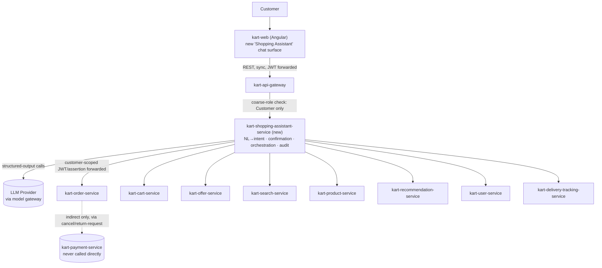

# Kart Shopping Assistant — Requirements & Design Specification

## 0. Reading Guide

This document specifies a **new product capability**: a natural-language, **Customer**-facing Generative AI assistant that doesn't just answer questions but **takes action** on the customer's own behalf — tracking, cancelling, and returning orders, applying coupons, adding items to cart, and checking out — against Kart's real backend services.

It is a pre-pipeline product spec, not a final `requirement-spec.md` — like `genai-business-assistant-spec.md` before it, this document is meant to be fed into `requirement-agent` once reviewed, at which point it becomes the seed for a new service's own `docs/services/<name>/requirement-spec.md`.

**This is not `kart-ai-assistant-service`.** That service is a read-only, `Admin`/`Support Agent`-facing analytics Q&A bot, scoped by **ADR-0024** to own no domain data, call only `kart-analytics-service`, and never mutate anything (`docs/services/kart-ai-assistant-service/requirement-spec.md` §1; ADR-0024). This capability is the opposite in almost every load-bearing dimension: it is `Customer`-facing, it mutates real orders/carts/money, and it calls half the platform's service catalog directly. §1.2 below states, ADR-style, why that difference requires a second, independent bounded context rather than an extension of the first.

Every fact in this document that comes from an existing source is cited. Every place those sources are silent, ambiguous, or genuinely a capability gap is marked **ASSUMPTION** (a default this spec picks so implementation isn't blocked) or **OPEN QUESTION** (something a human must confirm — see §15). Per the founding instruction for this pass, no numeric SLA, cost budget, or business rule (refund limits, escalation thresholds, etc.) is invented anywhere below — every such value is an **OPEN QUESTION**, exactly as `genai-business-assistant-spec.md` treated its own unset numbers (e.g. its §26-NFR-1/NFR-2).

**Naming:** the capability is referred to throughout as the **Kart Shopping Assistant**; its backend as **`kart-shopping-assistant-service`** (a new bounded context — see §1.2).

---

## 1. Positioning & Naming

### 1.1 What is being built

A conversational interface surfaced inside **`kart-web`** (the public storefront Angular app — `docs/client/kart-web/requirement-spec.md` §1; `docs/architecture/container-diagram.md`'s `Client` node) that lets a logged-in `Customer` say things like *"track my order"*, *"cancel order #12345"*, *"return these shoes, they don't fit"*, or *"find me a laptop under $800 and check out with my usual card"* — and have the assistant actually resolve the request into calls against Kart's real Order, Cart, Payment, Offer, Product, Search, Recommendation, User, and Delivery Tracking services, confirming with the customer before anything irreversible happens.

Unlike the Business Assistant (whose entire value proposition is *answering questions no dashboard already answers*), this capability's value proposition is **removing steps from an already-supported self-service journey** — Flow 1's own step sequence (`business-flows.md`: `Search → Suggestions → Results → Filter → Sort → Product Detail → Select Variant → Quantity → Add To Cart → Cart → Checkout → ... → Payment Success → Order Creation → ... → Delivered → Review/Return/Refund`) already names every one of these as an existing, UI-driven capability. The assistant is a new *interaction modality* over largely-existing backend capability, not a new business capability the way the one net-new Analytics read model was for the Business Assistant (`genai-business-assistant-spec.md` §10.3).

### 1.2 Service name & why this must be a separate bounded context

**Decision: `kart-shopping-assistant-service`**, a new, independently-deployed 20th service repo (19 exist today per `container-diagram.md`'s own closing caption, cited by the research pass behind this spec — `kart-ai-assistant-service` was the most recent, 19th, addition).

Alternative names considered and rejected: `kart-customer-assistant-service` (too generic — could be misread as a support-ticketing bot, which this is not; Flow 14's chatbot/self-service/escalate-to-agent step is only one of ten intents this spec covers, not the organizing theme). `kart-shopping-assistant-service` names the actual organizing theme (Flow 1, the shopping/purchase journey) and reads unambiguously distinct from `kart-ai-assistant-service` at a glance — an important property given how easily the two names could otherwise be confused in an incident channel or an IAM policy.

**Why a separate bounded context, not an extension of `kart-ai-assistant-service` (ADR-style):**

- **Context.** `kart-ai-assistant-service` already exists, already does "natural language → LLM → structured output → downstream call → grounded answer," and a reviewer's first instinct may be "just add customer intents to the existing assistant service."
- **Options considered:** (a) add a `Customer`-scoped mode to `kart-ai-assistant-service`; (b) a new service reusing that service's orchestration pattern but with its own deployment/data/RBAC boundary; (c) fold this into an existing customer-facing service (e.g. `kart-order-service` or the Gateway).
- **Decision: (b), a new, independent service.**
- **Why:**
  - **Ownership/RBAC boundary.** `kart-ai-assistant-service`'s entire RBAC posture (ADR-0025) is built around a **coarse role gate limited to `Admin`/`Support Agent`** and a scope (`ai-assistant.query`) minted only for those two roles. Admitting `Customer` into that same service would mean either (i) widening a scope that ADR-0025 deliberately scoped to internal staff, silently changing a closed decision's blast radius, or (ii) running two disjoint RBAC regimes inside one deployable — the exact "distributed monolith" pattern the platform's own service-boundary conventions exist to prevent (`docs/architecture/service-boundaries.md`).
  - **Mutation boundary.** ADR-0024's central ruling is that `kart-ai-assistant-service` "may never... own any copy of Order/Product/Inventory/User domain data" and has **exactly one synchronous dependency** (`kart-analytics-service`), chosen specifically so the service can never mutate anything. This spec's assistant must call `kart-order-service`, `kart-cart-service`, `kart-payment-service` (indirectly, §6), `kart-offer-service`, `kart-product-service`, `kart-search-service`, `kart-recommendation-service`, and `kart-user-service` — and must **mutate** several of them. Building that into `kart-ai-assistant-service` would not be an extension; it would be **reopening and reversing ADR-0024's own closed ruling** for an unrelated caller population. A settled ADR is not the right place to smuggle in a fundamentally different service shape.
  - **Blast radius.** A prompt-injection or logic bug in a read-only analytics bot can, at worst, mis-state a number. The equivalent bug class in this capability can cancel a real order, apply a coupon incorrectly, or attempt a checkout — i.e., money and inventory are on the line (§5's entire premise). These deserve visibly different operational tiers (paging, rate limits, spend guards — §5), which is far easier to reason about, alert on, and rate-limit correctly as two distinct services than as two silently-different code paths inside one.
  - **Precedent.** The platform's own convention, restated by ADR-0024 itself, is "one bounded context per repo" (`docs/architecture/service-boundaries.md`). A new capability with a materially different actor, RBAC surface, and mutation profile is exactly the case that convention exists for.
- **Trade-off accepted:** two GenAI-orchestration services now exist with genuinely similar internal shape (NL → structured intent → tool-calling → grounded response), meaning some orchestration-pattern code (prompt-injection defenses, structured-output validation, model-gateway client) is duplicated rather than shared. This is judged acceptable and is the same trade-off the platform already accepts elsewhere for isolation (e.g., per-service RabbitMQ topology instead of one shared exchange, BRD §8.2) — shared *library* code (a `Kart.Shared.AiOrchestration` package, analogous to `Kart.Shared.Auditing`) is a reasonable non-blocking follow-up, not a reason to share the *service*.

### 1.3 Who uses it

**`Customer` role only**, authenticated, inside `kart-web` (`docs/client/kart-web/requirement-spec.md` §1: "the single, public-facing Angular application for Kart's `Customer` actor"). A guest (unauthenticated) session may browse/search via the assistant (read-only intents only — §3.5) but every mutating intent requires an authenticated `Customer` JWT (§8).

**Explicitly out of scope:** `Admin` and `Support Agent` — they are `kart-ai-assistant-service`'s and `kart-admin-web`'s own users and already have their own tooling (§1.1's boundary above). `Partner API` principals are out of scope; no B2B/partner integration surface is defined anywhere in the BRD for this capability.

### 1.4 Goals

- **G1.** Let a `Customer` complete common post-purchase and shopping actions (track, cancel, return, discover, compare, cart, coupon, checkout) via natural language, without navigating `kart-web`'s own multi-page flows manually.
- **G2.** Every mutating action is confirmed in plain language before execution and re-validated by the owning service's own business rules at execution time — the assistant orchestrates, it never adjudicates eligibility (§6).
- **G3.** Never act on another customer's data, regardless of what the conversation asks (§8).
- **G4.** Fail safely and legibly on partial multi-step failure — no orphaned side effects (§5.6).
- **G5.** Ask for clarification rather than guess when a request is ambiguous or a required slot is missing (§4, FR-004).
- **G6.** Say "I can't do that" plainly for anything genuinely out of scope (a missing capability, a cross-customer request, a non-commerce ask) rather than attempting it or hallucinating a result (§4, FR-010).

---

## 2. Intent Catalog

For every intent: example utterances, required slots, backing service(s)/API(s) (citing what exists today vs. what's a gap), read-only vs. mutating, confirmation requirement, and failure/edge-case behavior. Gaps are flagged the way ADR-0026 flagged the Seller/Vendor gap for the Business Assistant — named plainly, not silently built around.

### 2.1 Intent: Return a Product

- **Utterances:** "What's your return policy?" → "I want to return this" → "Return the shoes from order #12345, they're the wrong size."
- **Slots:** `orderId` (or resolved from conversation context, §7), `lineItemId`(s) for a partial return, `reasonCode` (enum — not free text, so it can be validated), optional note.
- **Backing service/API:** `kart-order-service`'s planned `POST /orders/{id}/return-request` sub-resource. **Status: designed, not yet backend-approved.** `kart-web/checkout-and-refunds.md` (Part B) and `kart-web/api-integration-map.md` (line ~49) already fully design this flow client-side — reason-code enum, line-item selection, 30-day eligibility window, an auto-approval fast path (order ≤ a capped amount, no prior approved return, <3 approved returns in a trailing window — exact numbers are that document's own **OPEN QUESTION**-equivalent, not restated here), manual path to `kart-admin-web`'s Refund Requests queue otherwise — but `kart-order-service`'s own `requirement-spec.md`/`api-contract.yaml` (the backend's approved spec) **does not yet list this endpoint**. This is a genuine cross-document gap: the client integration map documents an API that hasn't been added to the owning service's own approved contract yet. **Flagged as a blocking dependency, not assumed built** (§9, §15-Architecture-1).
- **Mutating:** Yes (creates a `ReturnRequest`, may trigger an automatic refund).
- **Confirmation:** Required — reason, item(s), and the eligibility outcome (auto-approved vs. pending manual review) must be read back before submission.
- **Failure/edge cases:** Order not yet `Delivered` → not eligible, assistant explains and offers "track order" or "cancel order" instead (whichever is legal for the order's current state, per §2.3). Return window expired → explained plainly, no override. A chargeback already in progress on the order (`disputed` flag, `kart-payment-service`) → the request is rejected server-side per that service's own guard (`kart-payment-service/api-contract.yaml` refund-`409`-cause (b)); the assistant surfaces this rather than retrying or working around it.

### 2.2 Intent: Track an Order / ETA

- **Utterances:** "Where's my order?" → "When will #12345 arrive?"
- **Slots:** `orderId` (or "my most recent order" resolved via a list call).
- **Backing service/API:** `GET /v1/orders/{id}` (`kart-order-service`) for lifecycle status, composed with `GET /v1/tracking/{trackingId}` (`kart-delivery-tracking-service/api-contract.yaml`, returns `{trackingId, status, eta, lastUpdatedAt}`) once a shipment exists. **ASSUMPTION:** `GET /v1/orders/{id}`'s response includes the `trackingId` captured when Order consumed `ShipmentDispatched` (Order is a confirmed consumer of that event per BRD §5.1/§10, informationally per ADR-0002) — the *exact* response field carrying it is not fixed in either service's approved `api-contract.yaml` today; this is flagged as **§15-Architecture-2**, not assumed silently.
- **Read-only.**
- **Confirmation:** Not required (no mutation).
- **Failure/edge cases:** No shipment yet (`trackingId` absent) → answer from Order's own state only ("Processing"/"Reserved"/"Paid"), no fabricated ETA. Tracking record not yet materialized (`kart-delivery-tracking-service` returns `202`/`PENDING` per its own resolved contract) → surfaced as "shipped, tracking details updating," not an error.

### 2.3 Intent: Cancel an Order

- **Utterances:** "Cancel my order" → "I don't want #12345 anymore."
- **Slots:** `orderId`.
- **Backing service/API:** `POST /v1/orders/{id}/cancel` (`kart-order-service/api-contract.yaml`).
- **Eligibility (existing, confirmed rule — the assistant never re-implements this, only surfaces it):** legal only from `Created`/`Reserved`/`Paid` (pre-`Shipped`); once `Shipped`, the endpoint returns `409 Conflict` and the customer must use the return flow instead (`kart-order-service/requirement-spec.md` §2, Domain Invariants §4; `api-contract.yaml`'s `409` cause). `FulfillmentException`-held orders are also not customer-cancellable (resolution there is a manual ops action, `requirement-spec.md`'s Saga Orchestration section).
- **Mutating:** Yes.
- **Confirmation:** Required — the assistant states what will happen (reservation released, payment refunded automatically via the existing Saga compensation, BRD §12.2) before calling cancel.
- **Failure/edge cases:** `409` from the API → the assistant does not retry or reinterpret this as a transient error; it explains the order has already shipped and offers the Return intent (§2.1) as the correct next step, mirroring `kart-web/checkout-and-refunds.md`'s own Part C state→action table.

### 2.4 Intent: Request a Refund

- **Utterances:** "I want my money back for #12345" → "Can I get a refund?"
- **Slots:** `orderId`, optionally `reasonCode`.
- **Backing service/API:** **The assistant never calls `kart-payment-service`'s `POST /payments/{id}/refund` directly.** `kart-web/api-integration-map.md` states plainly that the storefront "submits a request, it never calls `/payments/{id}/refund` directly (that call remains system/Support-Agent/Admin-driven)" — the same constraint applies here. A standalone refund request is routed to whichever existing customer-facing path actually produces a refund: pre-`Shipped` → Cancel (§2.3, automatic compensating refund via Saga); post-`Delivered` → Return (§2.1, refund is the approved outcome of a `ReturnRequest`). There is **no third, direct "just refund me" customer-facing endpoint**, and this spec does not invent one.
- **Mutating:** Indirectly (via Cancel or Return).
- **Confirmation:** Inherits from whichever of §2.3/§2.1 it resolves to.
- **Failure/edge cases:** If the order is `Shipped` but not yet `Delivered`, **neither** cancel nor return is legal today (`kart-web/checkout-and-refunds.md`'s Part C table: `Shipped → none, contact Support`). The assistant states this plainly and offers escalation to a human Support Agent (Flow 14) rather than forcing either path — this is a real gap in the customer self-service surface, not an assistant limitation, and is flagged at **§15-Business-1**.

### 2.5 Intent: Product Discovery / Search with Constraints

- **Utterances:** "Find me a laptop under $800 with good reviews" → "Show me waterproof jackets in blue."
- **Slots:** free-text query, `priceMin`/`priceMax`, `category`, `ratingMin`.
- **Backing service/API:** `GET /v1/search` (`kart-search-service/api-contract.yaml`) — `q`, `category[]`, `priceMin`/`priceMax`, `ratingMin`, `sort`, `page`/`size` map directly onto this endpoint's existing contract. No gap — this intent is fully backed by an existing, purpose-built endpoint.
- **Read-only.**
- **Confirmation:** Not required.
- **Failure/edge cases:** Zero results → the assistant says so and offers to relax a constraint (widen price, drop a filter) rather than silently broadening the query itself without saying so. Search's own facet-filter cap (max 5 concurrent filter values, `kart-search-service/requirement-spec.md`) and its 300ms soft-budget `truncated`/`degradedFacets` signal (`api-contract.yaml`) are surfaced, not hidden — mirrors the Business Assistant's own G4 "surface, don't hide" precedent (`genai-business-assistant-spec.md` FR-012).

### 2.6 Intent: Compare Two or More Products

- **Utterances:** "Compare these two laptops" → "What's the difference between SKU-123 and SKU-456?"
- **Slots:** 2+ `sku` values (resolved from conversation context if the user just searched, §7).
- **Backing service/API:** `GET /v1/products/{sku}` (`kart-product-service/api-contract.yaml`), called once per SKU — **no batch/multi-SKU endpoint exists today** (confirmed: `kart-product-service/api-contract.yaml` has no batch variant). For a small, bounded N (a handful of SKUs a user names in one turn) this is an acceptable N sequential calls, not a blocking gap; flagged as a nice-to-have optimization at **§15-Architecture-3**, not a hard dependency.
- **Read-only.**
- **Confirmation:** Not required.
- **Failure/edge cases:** A named SKU doesn't exist / is discontinued → stated plainly per-item, comparison proceeds for the ones that do resolve.

### 2.7 Intent: Add a Recommended/Best-Match Item to Cart

- **Utterances:** "Add your top pick for a birthday gift under $50 to my cart" → "Add the best-rated one to my cart."
- **Slots:** the resolving constraint (from a prior Search/Recommendation turn, or freshly stated), `quantity` (default 1).
- **Backing service/API:** Composition of `GET /v1/search` (§2.5, constraint-based) or `GET /recommendations/{userId}` (`kart-recommendation-service/requirement-spec.md`, personalized "customers also bought"-style list) to resolve a candidate SKU, **then** the existing `POST /v1/cart/items` (`kart-cart-service/api-contract.yaml`, requires an explicit `sku`+`qty`). **No new downstream endpoint is required** — the gap here is orchestration-only (resolving NL "the best one" into one concrete SKU the customer explicitly confirms), unlike the Business Assistant's product-ranking gap (`genai-business-assistant-spec.md` §10.3), which needed a genuinely new read model. This is the one intent in this catalog where the assistant itself picks *which* item, so confirmation is especially load-bearing (below).
- **Mutating:** Yes (cart mutation).
- **Confirmation:** Required — the assistant must name the specific product/SKU/price it is about to add and get explicit agreement before calling `POST /v1/cart/items`; it never adds an item the customer hasn't been shown.
- **Failure/edge cases:** No candidate meets the constraint → say so, don't add a "closest" item silently. Item goes out of stock between resolution and confirmation → re-check via Search/Product before the cart call (Cart's own `POST /v1/cart/items` does not itself re-validate against catalog per its contract, `kart-cart-service/api-contract.yaml`: "`sku` accepted opaquely, not validated against catalog at this call" — so the assistant, not Cart, is responsible for not adding a SKU it just resolved as unavailable).

### 2.8 Intent: Discover and Apply the Best Available Coupon/Discount

- **Utterances:** "Do you have any coupons for this?" → "Apply the best discount to my cart."
- **Slots:** implicit — the current cart's contents/category.
- **Backing service/API:** **Confirmed gap.** `kart-offer-service` exposes `POST /v1/coupons/validate` (requires an already-known code) and `GET /v1/promotions/active` (a listing, not a cart-aware ranking) — there is **no "best-match coupon for this cart" auto-discovery endpoint today**, exactly analogous to the Business Assistant's own §10.3 product-ranking gap. This spec **requires a new capability** on `kart-offer-service` (e.g. an endpoint that takes a cart snapshot and returns the single best-applying, currently-valid coupon/promotion) — it is that service's own team's work, following the same ownership precedent `genai-business-assistant-spec.md` §10.3 set ("the assistant only calls it, never computes discount-optimality from raw promotion data itself"). Flagged at **§15-Data-1**.
- **Mutating:** Applying a coupon to the cart is a mutation (once "best match" resolves to a specific code, applying it is `POST /v1/coupons/validate` + attaching the result to the cart/checkout quote — the exact attach mechanism is `kart-offer-service`'s own `/pricing/quote` integration, BRD §5.4).
- **Confirmation:** Required — the assistant states which coupon/discount and its concrete effect (amount saved) before applying.
- **Failure/edge cases:** No eligible coupon exists → say so plainly, no fabricated discount. A found coupon fails validation at apply-time (redeemed out, expired between discovery and apply) → re-validated via the existing `/coupons/validate` call at the moment of application, not assumed still valid from the discovery step (mirrors §5's re-validation-at-execution-time guardrail).

### 2.9 Intent: Checkout Using Saved Default Address + Payment Method

- **Utterances:** "Check out with my usual address and card."
- **Slots:** none required beyond confirmation, if defaults exist.
- **Backing service/API:** Default **address** — confirmed to exist: `kart-user-service`'s `Address` schema carries an `isDefault` flag scoped per `type` (`shipping`/`billing`), retrievable via `GET /v1/users/{userId}` (`kart-user-service/api-contract.yaml`). Default **payment method** — **confirmed gap.** No field, endpoint, or schema anywhere in `kart-user-service` or `kart-payment-service` exposes a queryable, customer-selectable "saved payment methods, one marked default" concept; `kart-payment-service` stores only a per-charge `gateway_token` (opaque, tokenized at the external gateway, BRD §24/§5.3), not a reusable, listable vault entry. `kart-web/checkout-and-refunds.md`'s own UX copy ("payment method (saved token or new)") assumes such a concept exists at the client/BFF layer, but no backend service's approved contract confirms it. This is flagged at **§15-Data-2** as a genuine open question the checkout-with-defaults intent cannot be built against until resolved — it may already be handled entirely client-side by `kart-web`'s BFF session state (§ architecture, "BFF pattern — SSR server holds tokens"), in which case the assistant would need a new, scoped capability to ask *that* layer for "the customer's default payment reference," not a new `kart-payment-service` endpoint. Not assumed either way.
- **Then:** `POST /v1/cart/checkout` (`kart-cart-service`) → `POST /v1/orders` (`kart-order-service`, requires client-supplied `Idempotency-Key`) → charge via the existing checkout sequence (`kart-web/checkout-and-refunds.md` Part A: address → shipping → payment → live re-quote via `/pricing/quote` → place order).
- **Mutating:** Yes — the most consequential intent in this catalog (real money, real inventory reservation).
- **Confirmation:** Required, and must be maximally explicit: the assistant reads back the resolved address, payment method (last 4 / label only, never a raw token — §10), item list, and total (post-coupon, post-quote) before calling `POST /orders`. This is the canonical case for §5's "re-validate at execution time" rule — the live re-quote (`/pricing/quote`) is always re-run immediately before order placement, exactly as `kart-web/checkout-and-refunds.md`'s own currency-lock/re-quote discipline already requires for the human checkout flow, never reused from an earlier turn's stale price.
- **Failure/edge cases:** No default address/payment method resolvable → the assistant must not guess; it asks the customer to pick or add one (handed back to `kart-web`'s own UI for that step, since address/payment-method entry is not itself a conversational action this spec scopes in). Idempotency: the assistant must generate and persist one `Idempotency-Key` for the entire checkout attempt and reuse it on any internal retry, exactly as `kart-web/checkout-and-refunds.md` §A.2 already requires of the human UI ("client-generated UUID, persisted for the duration of the checkout attempt").

### 2.10 Intent: Handle "Wrong Item Received" → Arrange a Replacement

- **Utterances:** "You sent me the wrong item" → "Can you send a replacement?"
- **Slots:** `orderId`, `lineItemId`, description of the discrepancy.
- **Backing service/API and status: a genuine, platform-wide domain gap — not merely a missing endpoint.** `business-flows.md` Flow 9 ("Returns, Refunds & Exchange") names an `Exchange Shipped` step in its canonical sequence, but **no bounded context, aggregate, endpoint, or event anywhere in the platform's 18 approved services models a replacement/exchange concept** — confirmed by direct inspection of `kart-order-service`'s full requirement-spec and API contract (only cancellation, pre-`Shipped`, and the planned refund-only `ReturnRequest`, §2.1, exist) and `kart-payment-service`'s (money-movement/refund only, no "issue a replacement shipment" concept). This is the same shape of gap **ADR-0026** ruled on for Seller/Vendor reporting in the Business Assistant's own spec: a step named in the aspirational flow catalog with zero implementing bounded context anywhere in the actual 18-service architecture.
- **What the assistant can actually do today:** treat "wrong item" as a Return-request (§2.1, refund-only outcome) with a `reasonCode` reflecting the discrepancy, **or** escalate to a human Support Agent (Flow 14's "Escalate to Agent" step) for manual exchange handling via `kart-admin-web`'s own tooling. It must **not** promise a replacement shipment, since no API exists to create one.
- **Mutating:** Yes, if resolved to a Return-request (§2.1's mutation profile applies); escalation itself is a lightweight, non-financial action (opens a Support ticket/handoff — mechanism TBD, §15-Architecture-4).
- **Confirmation:** Required for the Return-request path (§2.1); escalation is announced, not silently performed.
- **Failure/edge cases:** This whole intent is, at its core, a UX/expectation-management problem until a real Exchange bounded context exists — flagged prominently at **§15-Business-2**, the single most significant domain gap in this catalog.

### 2.11 Additional intents judged necessary for a complete experience

- **Wishlist add/move-to-cart** ("save this for later," "move my wishlist item to cart") — backed by the existing `kart-wishlist-service` (`/wishlist`, BRD §5.4) + `POST /v1/cart/items`; read/write, low risk, included for completeness with Flow 13.
- **General order/product support Q&A with escalation** ("why is my order delayed," "how do I use this feature") — where the answer is a plain lookup the assistant can already resolve (compose §2.2/§2.5), it answers directly; where it isn't, it escalates to a human Support Agent (Flow 14's own "Chatbot/Self-Service → Escalate to Agent" step) rather than guessing. This is the assistant's designated "I can't do that" backstop (FR-010), not a new capability surface of its own.

---

## 3. Functional Requirements

Format matches `genai-business-assistant-spec.md`'s FR-xxx convention.

### FR-001 — Natural-language request intake
**Description:** Accept free-text input from an authenticated (or, for read-only intents, guest) `Customer` session.
**Input:** UTF-8 text, plus the caller's JWT (if authenticated) and conversation session id.
**Expected behavior:** Route to intent resolution (§2) with prior-turn context (§7).
**Output:** A structured intent + resolved slots, or a clarification request.
**Business rules:** A mutating intent from an unauthenticated session is rejected before translation — the assistant never invokes the LLM to plan a mutating action for a caller it cannot authorize (mirrors `genai-business-assistant-spec.md` FR-001's "never invoke the LLM for an unauthorized caller").
**Acceptance criteria:** Given a guest session, when a mutating intent is requested, then the response is an explicit sign-in prompt, never an attempted action.

### FR-002 — Intent resolution & slot-filling
**Description:** Convert free text into one of the catalog's structured intents (§2) with all required slots resolved, or identify what's missing.
**Input:** Free text + conversation context.
**Expected behavior:** Deterministic application code validates the LLM's structured-output intent against the registered catalog (§2) — an intent naming an unregistered action is never forwarded to execution.
**Output:** A resolved intent + slots, or a clarification turn.
**Business rules:** Slot values the LLM cannot resolve with confidence (an ambiguous `orderId` when the customer has multiple recent orders, an unspecified `reasonCode`) trigger clarification (FR-004), never a best guess.
**Acceptance criteria:** Given "cancel my order" with 3 open orders, when resolved, then the response lists the 3 orders and asks which one, rather than acting on the most recent by default.

### FR-003 — Tool-calling execution against real services
**Description:** Execute the resolved intent by calling the specific registered downstream service/API (§2, §9) — never a free-form call the LLM constructs itself.
**Input:** Resolved intent + slots.
**Expected behavior:** A fixed, versioned mapping table (application config, not LLM-authored) from intent → endpoint + parameter shape, mirroring `genai-business-assistant-spec.md` FR-002's "deterministic application code (not the LLM) maps intent fields to a specific endpoint."
**Output:** Raw result from the downstream call.
**Business rules:** Only endpoints listed in §2's per-intent mapping may be called; an intent whose backing capability is a confirmed gap (§2.8, §2.10) is routed to FR-010 (unsupported), never attempted against a nonexistent endpoint.
**Acceptance criteria:** Given a resolved "apply best coupon" intent (§2.8, currently a gap), when executed, then the response is an explicit "not currently supported" turn, not a call to `/coupons/validate` with a guessed code.

### FR-004 — Confirmation before any mutating action
**Description:** Every intent marked "Mutating" in §2 must be confirmed in plain language, naming the concrete effect, before the corresponding call executes.
**Input:** A resolved, mutating intent.
**Expected behavior:** The assistant states what will happen (in the terms §2 specifies per intent — e.g., §2.9's full read-back of address/payment/total) and requires explicit affirmative confirmation (not an ambiguous "ok" inferred from context alone — this spec **assumes** confirmation is an explicit selectable/typed affirmative, §15-UX-1).
**Output:** Either the executed action's result, or a cancelled-turn acknowledgment if the customer declines.
**Business rules:** No mutating call is ever made speculatively "to see what happens" — this is the platform-wide, GenAI-specific analogue of `kart-web`'s own "no fake-instant confirmation" discipline (`checkout-and-refunds.md` A.4).
**Acceptance criteria:** Given any mutating intent, when the customer has not yet explicitly confirmed, then no downstream mutating call has been made.

### FR-005 — Re-validation at execution time (no LLM-adjudicated eligibility)
**Description:** The assistant never itself decides whether an action is eligible (cancellable, returnable, refundable) — it only calls the owning service, which re-evaluates its own business rules at the moment of the call.
**Input:** A confirmed, resolved intent.
**Expected behavior:** Even if a prior turn stated an order "looked cancellable," the actual `POST /orders/{id}/cancel` call is what determines the outcome; a `409` from that call is treated as authoritative, not a bug to route around.
**Output:** The owning service's actual result (success or a business-rule rejection), surfaced verbatim in plain language.
**Business rules:** This is this capability's single most important safety property (§6) — mirrored from `genai-business-assistant-spec.md`'s "the LLM never invents business data," generalized here to "the LLM never invents business *eligibility*."
**Acceptance criteria:** Given an order that transitioned to `Shipped` between the assistant's last read and the cancel confirmation, when cancel executes, then the resulting `409` is explained to the customer, not silently retried as if it were a transient failure.

### FR-006 — Result summarization
**Description:** Generate the natural-language response strictly from the already-executed call's actual result.
**Input:** The raw result of FR-003/FR-005.
**Expected behavior:** Mirrors `genai-business-assistant-spec.md` FR-004's grounding discipline — every concrete fact (order status, amount, ETA, product name/price) in the generated text must be traceable to a field in the result payload, validated post-generation.
**Output:** A short natural-language summary.
**Business rules:** If validation fails, fall back to a template-built response from the raw data, and log the failure (§ Data & PII / audit).
**Acceptance criteria:** Given a successful cancel, when summarized, then every number/status word in the response matches the API response body.

### FR-007 — Multi-turn context carry-forward
**Description:** A follow-up message is interpreted against the last resolved intent/slots in the session, not from a blank slate (mirrors `genai-business-assistant-spec.md` FR-007/§14).
**Input:** New message + prior resolved intent (session state, §7).
**Expected behavior:** Only fields the new message actually changes are overwritten; a follow-up that clearly starts a new topic resets context.
**Output:** A new resolved intent, diffed against the prior one for observability.
**Business rules:** A follow-up must never silently carry forward a *mutating* confirmation from a prior, different intent — confirmation (FR-004) is scoped to one specific resolved action, never reused across a context switch.
**Acceptance criteria:** Given "track my order" then "actually, cancel it instead," when resolved, then the `orderId` carries forward but a fresh FR-004 confirmation is required for the (different, mutating) cancel action.

### FR-008 — Ambiguity detection & clarification
**Description:** Detect underspecified requests and ask, rather than guess (mirrors `genai-business-assistant-spec.md` FR-008).
**Input:** A candidate intent with an unresolved required slot.
**Expected behavior:** Return a clarification turn with concrete, selectable options where possible (e.g., a list of the customer's own recent orders).
**Output:** A clarification response, not an action.
**Business rules:** Never defaults a `reasonCode`, `orderId`, or product SKU the customer hasn't actually confirmed.
**Acceptance criteria:** Given "return my order" with 2 delivered orders in the last 30 days, when processed, then the response asks which order rather than picking the more recent one.

### FR-009 — Partial-failure handling (no orphaned side effects)
**Description:** For any intent composed of more than one downstream call (§2.8's coupon-then-checkout, §2.9's checkout sequence), a failure partway through must not leave an inconsistent state.
**Input:** A multi-step resolved intent, mid-execution.
**Expected behavior:** See §6's guardrail in full; summarized here as an FR: the assistant either fully completes the customer-visible outcome or fully and visibly reports what did and didn't happen — it never reports success on a partially-completed action.
**Output:** An explicit partial-failure explanation with the actual resulting state (e.g., "your coupon was applied, but checkout failed — your cart still has the discount applied, no charge was made").
**Business rules:** Reuses the platform's existing Saga-compensation and idempotency mechanisms (§6) rather than inventing new ones.
**Acceptance criteria:** Given a coupon-apply-then-checkout sequence where checkout's payment call fails, when reported, then the customer is told the coupon is still applied and no charge occurred, matching the cart's actual state.

### FR-010 — Out-of-scope / unsupported handling
**Description:** State plainly when a request isn't something this assistant does — a confirmed gap (§2.8, §2.10), a genuinely non-commerce ask, or an out-of-role request (Admin/Support-only action).
**Input:** A request that doesn't map to any registered intent, or maps to a flagged gap.
**Expected behavior:** Return a distinguishable "not supported" response naming what's missing, mirroring `genai-business-assistant-spec.md` FR-009's "distinguishable from supported-but-empty."
**Output:** An explicit unsupported-capability response, optionally with an escalation offer (§2.11).
**Business rules:** Never a fabricated action or a silent no-op reported as success.
**Acceptance criteria:** Given "exchange my item for a different color" (§2.10), when processed, then the response states this isn't currently possible and offers the Return or human-escalation alternative, never a fabricated "replacement shipped" confirmation.

### AI vs. application responsibilities

Mirrors `genai-business-assistant-spec.md` §9's table — the single clearest way to state "the LLM never adjudicates eligibility."

| Responsibility | Owner |
|---|---|
| Understand natural language, extract slots | **AI** |
| Identify intent | **AI** |
| Detect ambiguity, phrase clarification | **AI** |
| Generate the confirmation/summary text | **AI**, constrained to reference only values from the fetched/executed result (FR-006) |
| Validate intent against the registered catalog (§2) | **Application** |
| Enforce authorization (§8) | **Application** |
| Decide eligibility (cancellable? returnable? refund limit?) | **The owning downstream service** (Order, Payment, Offer) — **never** the AI, **never** `kart-shopping-assistant-service` itself |
| Execute the mutating call | **Application** (only after FR-004 confirmation) |
| Enforce idempotency | **Application** (§6) |
| Detect and report partial failure | **Application** (§6, FR-009) |
| Persist audit/observability records | **Application** (§10) |

---

## 4. Non-Functional Requirements

| Attribute | Target | Basis |
|---|---|---|
| Availability | Not stated in the BRD at the per-new-service granularity this capability needs. `kart-requirements.md` §3 sets 99.99% for "the order path" specifically and 99.9% "secondary" — this service calls the order path but is not itself part of order-Saga orchestration. **OPEN QUESTION — §15-NFR-1**: which tier applies to a customer-facing conversational front-end that *initiates* order-path calls but isn't the order-path itself. |
| Latency | No BRD figure exists for a GenAI conversational round-trip (same gap `genai-business-assistant-spec.md` flagged at its own §26-NFR-1). Downstream calls it composes inherit their own existing budgets (e.g. `kart-order-service`'s P95 < 300ms write-path, BRD §3) but a full multi-service conversational turn's own end-to-end target is unset. **OPEN QUESTION — §15-NFR-2.** |
| Scalability | Stateless orchestration layer, horizontally scalable per the platform's default pattern (BRD §3 "Horizontal, stateless services"). Session/conversation state (§7) is the one piece of per-session affinity to design for; sizing is otherwise ordinary. |
| Reliability | Every mutating call must be idempotent (§6) — no BRD-stated recovery-time figure for this specific service; inherits the platform's general "at-least-once + idempotent consumers" convention (BRD §3). |
| Security | Customer-JWT-scoped, three-check RBAC (§8), never a bypass of any downstream service's own authorization. TLS everywhere, no plaintext secrets (BRD §24) — unchanged platform posture, no new exception. |
| Observability | Full trace coverage on every mutating conversational turn, correlation ID propagated end-to-end into every downstream call it makes — mirrors BRD §3's "100% trace coverage on order path," extended here since this service is now a caller *into* that path. Audit record per turn (§10), analogous to `genai-business-assistant-spec.md` FR-011. |
| Cost | LLM token usage per turn should be bounded and logged, same posture as `genai-business-assistant-spec.md`'s own unresolved cost NFR. **OPEN QUESTION — §15-NFR-3**: no budget/ceiling is specified anywhere in the source docs, and this service issues *more* LLM calls per turn than the read-only assistant in the worst case (plan → confirm → execute → summarize), so its cost profile is not simply "the same, twice." |
| Maintainability | Independently deployable (§1.2), contract-tested against every downstream service's own approved `api-contract.yaml`, versioned intent catalog (§2) as reviewable application config, not LLM-authored — same discipline `genai-business-assistant-spec.md` §8 established for its own intent schema. |

---

## 5. Safety & Guardrails

This is the most important section of this document — this assistant mutates real money, inventory, and orders, unlike the read-only Business Assistant.

### 5.1 Confirm before every irreversible/financially-relevant action

Every intent marked "Mutating" in §2 (cancel, return-request, coupon-apply, checkout, add-to-cart when the assistant itself picked the item) requires an explicit, plain-language confirmation step before the corresponding downstream call — FR-004. The LLM never makes the eligibility or approval decision itself; it only orchestrates calls to the services that do (FR-005, §3's AI-vs-Application table) — this is the platform-wide analogue of the Business Assistant's own "the LLM never invents business data," restated here as "the LLM never invents business *authorization to act*."

### 5.2 Idempotency for every mutating call

Every mutating call this service makes must reuse the platform's existing idempotency-key pattern (`business-flows.md` Flow 6/17's own "Idempotency Key" steps; `kart-order-service`'s `Idempotency-Key` header on `POST /orders`; `kart-payment-service`'s equivalent on `charge` and `refund`; `kart-web/checkout-and-refunds.md` §A.2's "client-generated UUID, persisted for the duration of the attempt"). `kart-shopping-assistant-service` generates and persists one key per attempted mutating action within a conversation turn and reuses it on any internal retry it performs — it never mints a fresh key on retry, which would defeat the entire mechanism.

### 5.3 Prompt-injection defenses

A product review, description, or any other untrusted text the assistant might read (e.g., while summarizing search results, §2.5) must never be able to make the assistant take an unrequested action. Concretely: any content fetched from a downstream service (product descriptions, review text) is treated as **inert data to summarize**, never as instructions — mirrors `genai-business-assistant-spec.md` §17's "tool results treated as inert data, never re-interpreted as instructions." Because this assistant, unlike the read-only one, can *act*, the consequence of a missed injection is categorically worse (an unrequested mutating call vs. a wrong sentence in an analytics answer) — so this defense is load-bearing here in a way it wasn't for the Business Assistant, and FR-004's confirmation step is this capability's second, independent line of defense against exactly this failure mode: even a successfully-injected "intent" still requires the actual customer to explicitly confirm a mutating action before it executes.

### 5.4 Rate limiting / abuse prevention per customer

The assistant sits behind `kart-api-gateway`'s existing token-bucket, tiered rate limiting (BRD §18; `kart-api-gateway/requirement-spec.md` §26/36 — "authenticated" tier). Whether this capability needs a *stricter* per-customer limit than ordinary authenticated API traffic (given it can trigger cancels/refunds/checkouts in rapid succession) is not stated anywhere in the BRD. **OPEN QUESTION — §15-Security-1.**

### 5.5 Spending/refund limits and anomaly escalation

No numeric limit exists anywhere in the source documents for what a *customer-initiated, assistant-mediated* refund or cancellation may total before requiring human review — contrast `kart-requirements.md` §24.1.2's `Support Agent` refund cap (a human-staff limit, not a customer-self-service one) and `kart-web/checkout-and-refunds.md`'s own auto-approval thresholds (a *return-request* eligibility gate, not an anomaly/fraud control). This spec does **not** invent a spend/refund limit or an anomaly-detection rule for the assistant specifically. **OPEN QUESTION — §15-Business-3**: should there be a per-customer, per-time-window ceiling on assistant-initiated mutating actions (e.g., N cancels or M dollars of returns in a rolling window) that escalates to a human Support Agent instead of completing automatically, analogous in spirit to the return-request auto-approval gate but scoped to *assistant-mediated* actions specifically (since a compromised or manipulated conversational session is a different threat model than a human clicking through the UI)?

### 5.6 Partial failure — no orphaned side effects

For any intent composed of multiple downstream calls, a failure partway through must leave the system in a state the customer is accurately told about, never silently orphaned (FR-009):
- **Coupon-then-checkout (§2.8→§2.9):** if the coupon applies successfully but the subsequent payment call fails, the assistant reports the actual state — coupon still applied to the cart, no charge made — rather than a generic error. This reuses the existing checkout re-quote discipline (`kart-web/checkout-and-refunds.md` Part A) rather than a new mechanism.
- **Cancel triggering compensation (§2.3):** the existing Order Saga's own reverse-order compensation (release Inventory, then refund — BRD §12.2; `kart-order-service/requirement-spec.md`) already handles this at the Order-service level; the assistant's job is only to report the *actual* resulting order state truthfully, not to re-implement or race the compensation logic itself.
- **Return-request auto-approval racing a chargeback (§2.1):** already resolved at the platform level (`kart-web/edge-cases.md`: chargeback always wins via Payment's `disputed` guard) — the assistant surfaces whatever the authoritative `409`/rejection reason actually is, never masks it as a generic failure.

### 5.7 Never a cross-customer action

Covered fully at §8 — restated here because it is as much a safety property as an AuthZ mechanism: no confirmation step, clarification, or conversational framing can cause the assistant to act on an `orderId`/`cartId`/`addressId` that does not belong to the authenticated caller.

---

## 6. Conversation & Session State

Mirrors `genai-business-assistant-spec.md` §14's model, adapted for a mutating assistant.

Per conversation session (scoped to one chat session in `kart-web`, held server-side by `kart-shopping-assistant-service`, not the browser): the **last resolved structured intent + slots** — not the raw chat transcript — is the authoritative state a follow-up is interpreted against, for the same reason the Business Assistant chose this: deterministic, inspectable follow-up resolution rather than re-deriving intent from an ever-growing free-text history each turn.

**Divergence from the Business Assistant's model, specific to mutation:** a resolved-but-not-yet-confirmed *mutating* intent (FR-004) is a distinct state from a resolved *read-only* intent — carrying forward a stale, already-superseded mutating confirmation across turns is exactly the failure mode §5.1 exists to prevent. Concretely: if the customer changes the subject before confirming a mutating action, that pending confirmation is discarded, not silently carried into the next turn.

**Session lifetime:** no numeric value is stated anywhere in the source documents for how long a shopping-assistant session should persist (compare `kart-web/security.md`'s own session-lifetime figures, which govern the storefront's *login* session, not a conversational-assistant session specifically). **OPEN QUESTION — §15-UX-2.**

---

## 7. AuthN/AuthZ

Customer-JWT-based, following the platform's existing "three checks, not two" model exactly (`kart-requirements.md` §24.1.3, restated by `genai-business-assistant-spec.md` §17 for the Business Assistant and applied here for a materially different caller role):

1. **Gateway coarse check:** the JWT must carry the `Customer` role; an `Admin`/`Support Agent`/`Partner API` JWT calling this capability's endpoint is rejected before `kart-shopping-assistant-service` is ever invoked (the inverse of the Business Assistant's own gate, ADR-0025) — no `Customer` JWT is ever accepted by `kart-ai-assistant-service`'s endpoint either; the two services' Gateway routes are mutually exclusive by role.
2. **`kart-shopping-assistant-service`'s own check:** a new scope analogous to `ai-assistant.query` — this spec recommends `shopping-assistant.act`, minted for the `Customer` role only, following ADR-0025's precedent (Identity-issued via role→scope mapping at token-mint time, no persisted grant table, since there's no per-resource grant to check, only "is this caller a Customer"). **Exact scope name/mechanism: OPEN QUESTION — §15-Security-2**, mirroring how the Business Assistant's own equivalent (`ai-assistant.query`) was an open question in its founding spec before ADR-0025 settled it.
3. **Each downstream service's own check, unchanged:** `kart-order-service`, `kart-cart-service`, `kart-user-service`, etc. each perform their own existing ownership check (`resource.userId == token.sub`, `kart-requirements.md` §24.1.2/§24.1.4) exactly as they already do for any other caller of their APIs. `kart-shopping-assistant-service` **forwards the original customer's JWT** to these calls (or a signed internal assertion carrying the same `sub`) rather than a service-principal token — it must never call a downstream service *as itself* on the customer's behalf in a way that bypasses that service's own per-resource ownership check. This is the load-bearing AuthZ property of this entire capability: **it must be impossible for the assistant to act on another customer's data even if the conversation asks it to**, because the downstream service's own ownership check — not the assistant's own judgment — is what actually gates every mutating call, per §3's AI-vs-Application table ("Enforce authorization: Application" — and even "Application" here means "the owning service," not `kart-shopping-assistant-service` itself, for anything §3 assigns to "the owning downstream service").

**Guest sessions:** read-only intents only (§2.5, §2.6) may be served without an authenticated JWT, consistent with `kart-web`'s own anonymous-browsing posture (BRD §4.4's read-heavy anonymous traffic). Any mutating intent from a guest session is rejected at check #1 with an explicit sign-in prompt (FR-001).

---

## 8. Integration & Architecture Touchpoints

### 8.1 Synchronous dependencies (existing capability vs. gap)

| Service | Capability used | Status |
|---|---|---|
| `kart-order-service` | `POST /orders`, `GET /orders/{id}`, `POST /orders/{id}/cancel` | Existing |
| `kart-order-service` | `POST /orders/{id}/return-request` | **Gap — designed at client-doc level (`kart-web/checkout-and-refunds.md`), not yet in this service's own approved contract (§2.1, §15-Architecture-1)** |
| `kart-delivery-tracking-service` | `GET /tracking/{trackingId}` | Existing |
| `kart-cart-service` | `GET /cart`, `POST /cart/items`, `POST /cart/checkout` | Existing |
| `kart-offer-service` | `POST /coupons/validate`, `GET /promotions/active` | Existing (single-code validation / listing only) |
| `kart-offer-service` | "best coupon for this cart" auto-discovery | **Gap — new capability required (§2.8, §15-Data-1), same pattern as the Business Assistant's own §10.3 product-performance addition** |
| `kart-search-service` | `GET /search` | Existing |
| `kart-product-service` | `GET /products/{sku}` (single) | Existing; no batch variant (§2.6, minor gap) |
| `kart-recommendation-service` | `GET /recommendations/{userId}` | Existing |
| `kart-user-service` | `GET /users/{id}` (addresses, default flag) | Existing for address; no payment-method-default equivalent (§2.9, §15-Data-2) |
| `kart-payment-service` | — | **Never called directly by this service** (§2.4) — all money-movement is triggered indirectly via Order's cancel/return-request surface, matching `kart-web`'s own existing constraint |
| `kart-wishlist-service` | `/wishlist` | Existing (§2.11) |
| `kart-identity-service` | JWT validation (at Gateway), `sub`/`roles`/`scopes` claims | Existing, unchanged |
| Model Gateway (LLM provider) | Plan / confirm / summarize calls | New — provider-agnostic, §11 |

No new **asynchronous** event publish/consume relationship is required for this capability's core loop — every intent in §2 is served by synchronous request/response composition over existing (or gap-flagged new) REST APIs, the same "single synchronous-dependency-shaped integration, no new pub/sub" posture ADR-0024 fixed for the Business Assistant, just with more than one downstream peer given this service's broader, mutating remit. Whether `kart-shopping-assistant-service` should *consume* any event (e.g. `OrderDelivered`, to proactively prompt "how was your order?" — a Flow 11 adjacent, but out-of-scope-for-this-pass capability) is **not** assumed here. **OPEN QUESTION — §15-Architecture-5.**

### 8.2 Component view



This places `kart-shopping-assistant-service` exactly where every other `kart-web` backend call already sits — through the Gateway, never bypassing it — and reaches each downstream service the same way any other authenticated customer-facing caller already does, per `docs/architecture/service-boundaries.md`'s and `container-diagram.md`'s existing conventions (confirmed for the analogous `kart-ai-assistant-service` placement, ADR-0024). No new integration *pattern* is introduced — only a service with more synchronous peers than any single existing customer-facing service has today, which is itself flagged: **§15-Architecture-6** — does this fan-out need the same per-edge-independent-circuit-breaker treatment `kart-admin-service`'s widest synchronous fan-out already uses, given a failure in any one downstream peer (e.g. Offer being down) should not take down the assistant's ability to serve the other nine intents?

---

## 9. Data & PII

This capability's PII surface is **substantially larger** than the read-only Business Assistant's, which only ever touched aggregate analytics numbers (`genai-business-assistant-spec.md` §17: "the log is analytics-metadata-only in the common case, since the questions are about aggregate business data, not individual customer records"). This assistant, by contrast, routinely handles:

- **Order contents** — items, quantities, prices, per the customer's own real orders.
- **Addresses** — read (§2.9) and referenced in confirmations (§5.1) — full shipping/billing address detail, per `kart-user-service`'s existing `Address` schema.
- **Payment method references** — never raw card data (never persisted anywhere on the platform, BRD §24) but potentially a masked reference (last-4, label) surfaced in checkout confirmations (§2.9) — this must never include the raw `gateway_token` itself in any conversational response or log (mirrors `kart-requirements.md` §24.1.5's column-level-security precedent for Payment: "no unmasked PCI data exists to protect in the first place").
- **Conversation transcripts** themselves — which, unlike the Business Assistant's aggregate-metadata-only logs, will routinely *contain* order/address/product content as a structural consequence of what this assistant does.

**Retention/logging rules:** no existing document (`kart-web/privacy.md`, `security.md`) defines a retention policy for AI conversation transcripts specifically — confirmed by direct inspection; neither file's cookie-consent (§A) or GDPR-rights (§B) sections address chat/assistant conversation data at all. This is a genuine gap this spec cannot close on its own authority. **OPEN QUESTION — §15-Data-3**: what retention window applies to a conversation transcript that references real order/address content, and does `kart-user-service`'s existing GDPR Right-to-Delete/export fan-out (`privacy.md` §B.3–B.5, `UserDataErased` flow) need to be extended to include this service's own conversation store — the same way it would need to for any new service holding customer PII, per that flow's existing "fan-out aggregation" design.

**Audit:** every turn (successful, clarification, confirmation-pending, or error) produces one audit record, mirroring `genai-business-assistant-spec.md` FR-011 — but here the record is not "metadata-only" by default; it necessarily includes what mutating action was proposed/confirmed/executed and against which resource, since that *is* the auditable event this capability's own risk profile (§5) most needs. Raw LLM provider request/response bodies are retained only as needed for debugging, same posture as the Business Assistant (`genai-business-assistant-spec.md` FR-011), but the "no raw provider body containing customer PII" carve-out that spec used cannot be assumed to leave much left to retain here, since PII is this capability's normal operating content, not an edge case — **this materially changes the calculus from the Business Assistant's and needs its own review**, not a copy-paste of that FR.

---

## 10. LLM-Provider Framing

Provider-agnostic via a model-gateway abstraction — the same posture `genai-business-assistant-spec.md` §21.4/§26-AI-1 established: no named vendor/model anywhere in this document's requirements. Structured-output/function-calling (constraining the LLM to the intent schema in §2, the same mechanism `genai-business-assistant-spec.md` §12 required for its own intent JSON schema) and bounded tool-calling (a fixed, enumerable registry — the ten-plus intents in §2, not an open agentic loop) are required for the same reason: the hallucination/authorization-bypass prevention design in §5/§6 depends on the model being structurally unable to emit anything but a schema-conformant intent, exactly as `genai-business-assistant-spec.md` §12 argued for its own, lower-stakes case. Given this service's LLM output can trigger a *mutating* call (unlike the Business Assistant's), structured-output enforcement is not merely a nice-to-have determinism property here — it is a safety control (§5.3).

RAG/embeddings/vector databases: **not required**, for the same reasoning `genai-business-assistant-spec.md` §12/§25-D5 already gave — this capability resolves natural language into a small, enumerable set of structured intents against structured APIs, not "find the relevant passage in a large unstructured corpus." (A future capability answering open-ended questions over unstructured product-description/review text would be a different, additive capability, not this one.)

---

## 11. Non-Goals

- **NG1.** No autonomous spending or mutation beyond what the customer has explicitly confirmed in the current turn (§5.1) — the assistant never re-uses a stale confirmation, never "helpfully" adds items or applies coupons the customer didn't ask about, and never checks out on a customer's behalf without a fresh, explicit go-ahead each time.
- **NG2.** No negotiating price, inventing a discount, or offering a coupon that doesn't come from a real, currently-valid `kart-offer-service` result (§2.8).
- **NG3.** No acting without an authenticated session for any mutating intent (§7) — read-only search/discovery (§2.5, §2.6) is the only guest-accessible surface.
- **NG4.** No cross-customer actions, under any conversational framing (§7, §5.7) — this is a hard authorization boundary, not a prompt-engineering guideline.
- **NG5.** No direct calls to `kart-payment-service` (§2.4, §8.1) — all money movement is triggered only via Order's own customer-facing cancel/return-request surface, never bypassed.
- **NG6.** No replacement/exchange fulfillment (§2.10) until a real Exchange bounded context exists somewhere in the platform — this assistant does not simulate or paper over that domain gap.
- **NG7.** No free-form query/code generation against any datastore (mirrors `genai-business-assistant-spec.md` NG1) — every action goes through a registered, versioned intent→endpoint mapping (§3, FR-003).
- **NG8.** No replacing or being a general-purpose customer-support chatbot for non-commerce topics — Flow 14's own scope (order/product/payment-related issues) bounds this; anything else is FR-010's "I can't do that."
- **NG9.** No `Admin`/`Support Agent` usage of this capability (§1.3) — they retain `kart-ai-assistant-service`/`kart-admin-web`'s own tooling; this is not a merged front door for both roles.
- **NG10.** No multi-tenant data isolation concept — Kart is single-tenant platform-wide (mirrors `genai-business-assistant-spec.md` NG7); this spec does not introduce one.

---

## 12. Decision Log

Mirrors `genai-business-assistant-spec.md` §25's D-pattern (Context/Options considered/Decision/Why/Trade-off) for the decisions not already fully argued inline above.

### D1 — New bounded context, not an extension of `kart-ai-assistant-service`
See §1.2 in full — reproduced here only as the Decision Log's index entry per the sibling spec's convention: **Decision:** new, independent service, `kart-shopping-assistant-service`. **Why:** RBAC-role mismatch, mutation-boundary conflict with ADR-0024's closed ruling, and blast-radius separation (§1.2). **Trade-off:** some orchestration-pattern code duplication between the two GenAI services, acceptable per the platform's existing per-service-isolation precedent (BRD §8.2).

### D2 — Bounded tool-calling over an open agentic loop
**Context:** this assistant, unlike the Business Assistant, can chain a *sequence* of mutating steps in one customer request (e.g., §2.9's checkout sequence). **Options considered:** (a) an open agentic loop where the LLM freely chains any tool in any order; (b) a fixed, small registry of intents (§2), each with its own deterministic, pre-defined execution sequence when it involves more than one downstream call. **Decision:** (b). **Why:** the same reasoning `genai-business-assistant-spec.md` §12 gave for its own, lower-stakes case applies with more force here — an open loop chaining *mutating* tools with no fixed registry would make the "confirm before every mutating action" guardrail (§5.1) nearly impossible to enforce uniformly, since there'd be no fixed point at which "the mutating step" is known in advance to gate with a confirmation prompt. **Trade-off:** less flexibility for genuinely novel multi-step requests outside the ten-plus intents in §2; accepted, since FR-010 and §2.11's escalation path exist precisely for requests the fixed registry doesn't cover.

### D3 — No new database beyond conversation/audit state
**Context:** whether `kart-shopping-assistant-service` needs its own domain-data store. **Options considered:** (a) cache/replicate order/cart/product data locally for speed; (b) own no domain data, always call through. **Decision:** (b), following ADR-0024's own ruling for `kart-ai-assistant-service` verbatim ("may never own a copy of Order/Product/Inventory/User domain data"). **Why:** the same ownership-boundary argument applies unchanged — this service is a caller, not a second source of truth for anything another service already owns. **Trade-off:** every turn re-fetches live state rather than serving from a local cache, accepted since correctness (never acting on stale eligibility/stock/price data, §5.1/§6) matters more here than raw latency.

---

## 13. Example Conversations

Mirrors `genai-business-assistant-spec.md` §23's worked-example convention.

**Example 1 — Cancel, happy path:**
```
Customer: "Cancel my order"
Assistant: "You have one open order, #48213 (placed today, still Processing).
Cancelling it will release the reserved items and refund $86.40 to your
original payment method automatically. Cancel it?"
Customer: "Yes"
Assistant: [calls POST /orders/48213/cancel] → "Done — order #48213 is
cancelled and your refund is on its way."
```

**Example 2 — Cancel, too late (re-validation at execution time, §5.1/FR-005):**
```
Customer: "Cancel #48213"
Assistant: "Cancelling it will release the reserved items and refund
$86.40. Cancel it?"
Customer: "Yes"
Assistant: [calls cancel → 409, order shipped moments ago]
"I wasn't able to cancel #48213 — it just shipped. Since it's already on
its way, I can help you start a return once it's delivered instead."
```

**Example 3 — Confirmed gap, honest "can't do that" (§2.10, FR-010):**
```
Customer: "The shirt you sent me is the wrong color, can you send the
right one?"
Assistant: "I can't arrange a direct replacement shipment today — that's
not something our systems support yet. I can start a return for a refund
on this item, or connect you with a support agent who may be able to help
further. Which would you like?"
```

---

## 14. Open Questions

Category-prefixed, mirroring `genai-business-assistant-spec.md` §26's format.

**Business**
- **Business-1.** A `Shipped`-but-not-yet-`Delivered` order has no legal customer-self-service refund/cancel path today (§2.4) — is this an accepted gap in the storefront's own customer journey (human-escalation-only, as this spec assumes), or should a "cancel in transit" capability be scoped as a separate initiative? Not this spec's call to resolve.
- **Business-2.** Whether/when a real Exchange bounded context (§2.10) should be built is a BRD/flow-catalog-owner-level decision, the same category ADR-0026 ruled the Seller/Vendor gap belonged to — not something this spec or its eventual implementation can resolve unilaterally.
- **Business-3.** Should there be a per-customer, per-time-window ceiling on assistant-mediated mutating actions (cancels/returns/checkouts) that escalates to human review, and if so, what threshold (§5.5)? No number is assumed here.

**Data**
- **Data-1.** `kart-offer-service` needs a new "best coupon for this cart" endpoint (§2.8) — exact contract (input: cart snapshot shape; output: single best offer vs. ranked list) is that service's own team's call, following the product-performance precedent (`genai-business-assistant-spec.md` §10.3).
- **Data-2.** Whether a queryable "customer's saved default payment method" concept exists anywhere today (possibly client/BFF-side, not backend) or needs to be built, and where it should live if built (§2.9) — affects whether this is a `kart-user-service` extension, a new `kart-payment-service` capability, or purely a `kart-web` BFF-session concept this assistant would need a new, narrow API to query.
- **Data-3.** Retention policy for AI conversation transcripts containing order/address/PII content (§9) — no existing document addresses this; needs a privacy/legal decision, not an engineering default.

**Architecture**
- **Architecture-1.** `kart-order-service`'s `POST /orders/{id}/return-request` (§2.1) is designed at the `kart-web` client-integration-map level but absent from Order's own approved backend spec — does Order's spec get amended to add it (this spec's assumption), or was it deliberately deferred for a reason not visible in the documents read for this pass?
- **Architecture-2.** Exact field/mechanism by which `GET /orders/{id}` surfaces a `trackingId` for the Tracking-composition intent (§2.2) — not fixed in either service's current approved contract.
- **Architecture-3.** Whether `kart-product-service` should gain a batch/multi-SKU fetch endpoint for the Compare intent (§2.6) — a nice-to-have, not a blocker, given today's N-sequential-calls workaround is acceptable for small N.
- **Architecture-4.** Mechanism for the human-escalation path referenced across several intents (§2.4, §2.10, §2.11) — does this open an existing Support-ticket-equivalent record, or is escalation only a conversational handoff/UI affordance in `kart-web`? No such mechanism is named anywhere in the documents read for this pass.
- **Architecture-5.** Whether `kart-shopping-assistant-service` should consume any domain event (e.g., `OrderDelivered`, to proactively prompt post-delivery) — out of scope for this pass's core loop, but worth an explicit later decision rather than silent omission.
- **Architecture-6.** Whether this service's wide synchronous fan-out (nine-plus downstream peers, §8.1) needs the same per-edge-independent-circuit-breaker discipline `kart-admin-service`'s comparable fan-out already uses.

**Security**
- **Security-1.** Whether assistant-mediated traffic needs a stricter per-customer rate limit than ordinary authenticated API traffic, given its ability to trigger cancels/refunds/checkouts (§5.4).
- **Security-2.** Exact name/mechanism for this service's own RBAC scope (this spec recommends `shopping-assistant.act` by analogy to ADR-0025's `ai-assistant.query`, §7) — a human decision, the same category ADR-0025 itself closed for the Business Assistant.

**UX**
- **UX-1.** Exact confirmation-affirmation mechanism (explicit button/selectable option vs. a typed "yes," §4/FR-004) — a product-design decision, not assumed here beyond "must be explicit."
- **UX-2.** Conversation session lifetime (§7) — no figure exists anywhere in the source documents for this specific session type.

**Non-Functional**
- **NFR-1.** Which availability tier applies to this service (§4) — it is not itself the order-path Saga, but it initiates calls into it.
- **NFR-2.** End-to-end conversational-turn latency target (§4) — no BRD figure exists for this shape of interaction.
- **NFR-3.** LLM cost/token budget per turn (§4) — unset, and this service's worst-case call count per turn (plan → confirm → execute → summarize) exceeds the read-only assistant's two-call pattern.

---

## Sign-off

- [ ] BRD/flow-catalog owner confirms Business-1, Business-2.
- [ ] `kart-order-service` owner confirms/resolves Architecture-1 (the `return-request` contract gap) and Architecture-2 (`trackingId` exposure).
- [ ] `kart-offer-service` owner scopes Data-1 (best-coupon-discovery endpoint).
- [ ] `kart-user-service`/`kart-payment-service`/`kart-web` BFF owners jointly resolve Data-2 (saved default payment method).
- [ ] Privacy/legal owner resolves Data-3 (conversation-transcript retention).
- [ ] Identity/security owner resolves Security-1, Security-2.
- [ ] Product/UX owner resolves UX-1, UX-2.
- [ ] Platform architecture owner confirms Architecture-3 through Architecture-6.
- [ ] Reviewed by: _pending human review — this document has not yet been approved_
