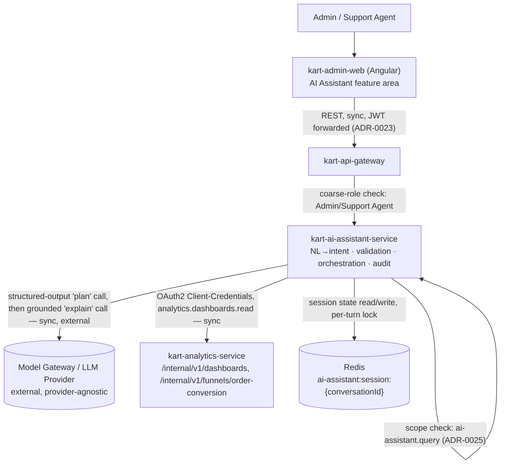

# Architecture: kart-ai-assistant-service

## Boundary Rationale

`kart-ai-assistant-service` is a new, independently deployed bounded context — **the platform's 19th deployable repo** — closed by [ADR-0024](../../adr/0024-ai-assistant-service-scope-and-integration.md), and that placement decision is not re-derived or re-litigated here. In DDD terms it is an **orchestration/control-plane caller** of `kart-analytics-service`'s data, the same relationship `kart-admin-service` holds toward Product/Category/Offer/Identity/Inventory's data (ADR-0010's framing, applied here by ADR-0024's own direct analogy) — just read-only instead of write-through, and single-dependency instead of five-way fan-out. It owns no Core-domain aggregate (no `Product`, `Order`, `Revenue`) and asserts no write authority over any other service's state (requirement-spec §1, §4 — read-only, full stop). Its bounded context is exactly two local concerns: conversation/session state (the last resolved structured intent per session) and its own append-only audit log (ADR-0024's ownership table) — everything else it surfaces is Analytics' data, passed through, never re-owned.

This gives it the narrowest possible dependency footprint consistent with actually doing its job: unlike Analytics (zero synchronous coupling in either direction, per `kart-analytics-service/architecture.md`), this service must make exactly one synchronous call per turn to have anything to say — but that call is to a single, already-isolated, read-only peer, never to a Core/write-path service (Order, Product, Inventory, User).

## Component / Boundary Diagram

This is the same shape the source spec's own §10.4 component view and §21.3 dependency statement already establish — restated here, not re-derived: `kart-admin-web` never bypasses the Gateway (ADR-0024), the Gateway forwards the original client JWT unchanged (ADR-0023), and `kart-ai-assistant-service` sits as a single new node between the Gateway and exactly two downstream peers — one Kart service (`kart-analytics-service`) and one external system (the Model Gateway / LLM provider). No other node, Kart-service or otherwise, appears in this service's outbound call graph.

## Dependencies

| Direction | Peer | Mechanism | Type |
|---|---|---|---|
| Inbound (client) | Admin / Support Agent, via `kart-admin-web` → API Gateway | `POST /v1/ai-assistant/query` (`security: bearerAuth: [ai-assistant.query]`, ADR-0025) | Sync |
| Outbound | `kart-analytics-service` | `GET /internal/v1/dashboards/*`, `GET /internal/v1/funnels/order-conversion` (nine existing + funnel, unchanged) plus `GET /internal/v1/dashboards/product-performance` (new, Analytics-owned) — OAuth2 Client-Credentials, `analytics.dashboards.read` | Sync |
| Outbound (external, non-platform) | Model Gateway / LLM Provider | Two calls per turn via the platform's `ModelProvider` interface (`PLATFORM_BLUEPRINT.md` §8.1): a structured-output "plan" call, a grounded "explain" call | Sync (external) |
| Shared-state (not a service call) | Redis (platform-shared deployment, service-namespaced) | `ai-assistant:session:{conversationId}` (last resolved intent + prior-turn provenance), `ai-assistant:session-lock:{conversationId}` (per-turn lock) | Shared infra, sync read/write on the request path |
| Outbound (published) | — none — | This service publishes zero platform events (ADR-0024; requirement-spec §5) | — |
| Inbound (consumed) | — none — | This service consumes zero platform events (ADR-0024; requirement-spec §5) | — |

**Confirmed, not re-derived:** exactly **one** synchronous dependency on another Kart bounded context — `kart-analytics-service` — and no other Kart-service dependency of any kind, synchronous or asynchronous. No direct calls to `kart-order-service`, `kart-product-service`, `kart-inventory-service`, or `kart-user-service` exist or are planned (requirement-spec §5, §21.3 of the source spec, ADR-0024). No asynchronous publish or consume relationship exists — this service neither produces nor subscribes to any platform event (ADR-0024, stated explicitly per the `kart-admin-service`/`kart-identity-service` precedent for purely-synchronous services, not left silently blank). The Model Gateway/LLM-provider edge and the Redis shared-state edge are the only other outbound dependencies of any kind this service holds, and neither is a Kart bounded-context peer — the LLM is an external system (same category as `PaymentGW`/`Carriers` in `docs/architecture/system-context.md`), and Redis is shared platform infrastructure, not a service call (the same category `kart-identity-service/architecture.md` already places its own `identity:revocation:*` Redis edge in).

Any future proposal to add a second downstream Kart-service dependency or an event-bus edge is a scope change requiring its own ADR (ADR-0024's own consequence), not an incremental addition this document, the DDD Agent, or the API Design Agent has standing authority to make.

## Deployment / Scaling Posture

**Stateless orchestrator, horizontally scalable, consistent with the platform-wide default** (requirement-spec §3 Scalability NFR). Every request-handling instance is interchangeable — no request is pinned to a specific instance, and no instance holds authoritative state that would be lost on restart or that a load balancer would need to route around.

**Where does "stateless" leave the conversation state, then?** In Redis, not in-process — this is the design-decisions.md "Conversation-Session Storage" decision, restated here as an architecture-level confirmation rather than re-derived: the last resolved structured intent per session (plus prior-turn `isProvisional`/`reconciledThrough` provenance) lives in `ai-assistant:session:{conversationId}`, on the platform's existing shared Redis deployment, namespaced per the platform's standing convention (`service:entity:id[:shard]`). This is the same pattern `kart-cart-service` (cart state) and `kart-identity-service` (`identity:revocation:*`, `identity:mfa-challenge:*`) already use for ephemeral, TTL-bound, per-key state — not a new infrastructure dependency, and not a break from statelessness:

- **Does this violate the stateless-orchestrator posture? No.** "Stateless" describes the *compute* layer (any instance can serve any request, no session-affinity/sticky-routing is required, and losing an instance loses no unrecoverable state) — it does not mean "no state exists anywhere in the system." A stateless orchestrator backed by an external, shared, addressable store (Redis here; a database in the more common case) is the textbook shape of a horizontally scalable service, the same shape `kart-cart-service` and `kart-identity-service` already are. If session state were held in-process instead, *that* would be the violation — a follow-up turn landing on a different instance than the one that handled the prior turn would silently lose context, and a rolling deploy would drop every in-flight conversation. Redis is precisely what avoids that failure mode while keeping every instance interchangeable.
- **What's on the request's hot path vs. not:** the per-turn Redis read/write (session state) and per-turn Redis lock (`ai-assistant:session-lock:{conversationId}`, the Concurrency Control decision) are both on the synchronous request path for any turn carrying a `conversationId`; a fresh, no-`conversationId` turn never touches Redis at all. This means a Redis outage degrades follow-up interpretation (forces every turn to be treated as fresh, or surfaces the "expired session" error) but never blocks a fresh, context-free question and never blocks horizontal scale-out (design-decisions.md, same decision, "Trade-off accepted").
- **Compute scaling factor:** per requirement-spec §3, LLM call latency — not this service's own compute — is the natural rate-limiting factor; instance count scales on request concurrency the same way every other platform service does, with no session-affinity requirement to complicate the scaling policy.

## Distributed-Monolith Risk

This service adds one new synchronous edge to the platform's call graph (`kart-ai-assistant-service` → `kart-analytics-service`). The case for why this does **not** constitute distributed-monolith risk, made explicitly rather than asserted:

- **Not chatty.** One synchronous Kart-service call per user-facing turn, not a chain — the plan call and explain call are to an external LLM, not a second internal service hop, and neither call fans out to a further Kart-service dependency. Contrast with the platform's own named chatty-risk precedent (`kart-recommendation-service`'s two new synchronous outbound calls, flagged and mitigated with fail-open timeouts in that service's own `architecture.md`) — this service has exactly one such edge, not two, and it is this service's *only* way to answer any query at all, not an optional enrichment call.
- **Not transitive.** `kart-analytics-service`'s own `architecture.md` establishes "zero synchronous coupling in either direction — no public inbound endpoint, no synchronous outbound dependency on any other service." This service's one synchronous edge therefore terminates at Analytics; it cannot cascade into a second or third hop, because Analytics itself has nothing further to synchronously call. This is the strongest possible shape a single sync dependency can take — a dead-end call to an already fully isolated peer, not a link in a longer chain.
- **Real availability coupling exists, and is named rather than hidden.** `kart-ai-assistant-service` cannot answer *any* data-backed query while Analytics is down — edge-cases.md's "`kart-analytics-service` Unavailable/Timeout" decision is explicit that "an Analytics outage fully blocks every query type this service supports," with no caching or LLM-improvised fallback permitted (FR-003/ADR-0024). This is a real, accepted coupling, not distributed-monolith risk in the classic sense: it is a single dependency edge with a circuit breaker (design-decisions.md's Resilience Pattern decision), it fails closed rather than cascading or hanging, and the coupled service's own availability tier (99.9%, `kart-analytics-service/requirement-spec.md` §3) already exceeds what this service's own Availability NFR claims for itself ("best-effort... inheriting Analytics' own 99.9% posture rather than a target this service can independently exceed," requirement-spec §3). A service cannot be said to be pathologically over-coupled to a dependency it explicitly does not try to out-perform.
- **Sync is the right choice here, not a mis-applied pattern.** The call is a synchronous, user-facing question/answer turn that must return data within the same HTTP response — there is no plausible async/event-driven substitute for "fetch this number so I can answer the question the user is waiting on right now." This is the inverse of the platform's other named distributed-monolith risk shape (a synchronous chain that *should* be async); nothing here should be async instead.
- **The LLM/Model-Gateway edge is a separate, external-system risk category, not a Kart-service coupling.** It is mitigated the same way (independent circuit breaker, bounded retry, differentiated plan-vs-explain fallback per design-decisions.md's Resilience Pattern decision) but is out of scope for a *distributed-monolith* assessment specifically, since that term describes over-coupling between a platform's own bounded contexts, not a dependency on a genuinely external vendor system (the same category the platform already treats `PaymentGW`/`Carriers` as, per `docs/architecture/system-context.md`).

**Conclusion: no distributed-monolith risk is introduced by this service or its one dependency.** A single, non-chained, non-transitive synchronous edge to an already-isolated, read-only peer — with a circuit breaker, a fail-closed posture, and an accepted-not-exceeded availability tier — is the narrowest possible shape a required synchronous dependency can take. The only genuine, load-bearing coupling this service accepts is "Analytics being down fully blocks this service," which is a direct, intended consequence of ADR-0024's own design (a thin orchestrator over Analytics' data, not a second source of truth for it), not an accidental symptom of over-coupling to work around.

## Sign-off

- [ ] Reviewed by: _pending human review — this document has not yet been approved to proceed to the DDD Agent_
- [ ] Approved to proceed to DDD Agent
