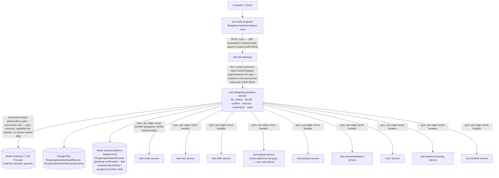

# Architecture: kart-shopping-assistant-service

## Boundary Rationale

`kart-shopping-assistant-service` is a new, independently deployed bounded context — **the platform's 20th deployable repo** — closed by [ADR-0028](../../adr/0028-shopping-assistant-service-scope-and-integration.md), and that placement is not re-derived or re-litigated here. In DDD terms it is an **orchestration/control-plane caller** across nine existing bounded contexts (`kart-order-service`, `kart-cart-service`, `kart-offer-service`, `kart-search-service`, `kart-product-service`, `kart-recommendation-service`, `kart-user-service`, `kart-delivery-tracking-service`, `kart-wishlist-service`) — the same relationship `kart-ai-assistant-service` holds toward `kart-analytics-service` (ADR-0024) and `kart-admin-service` holds toward its own five peers (ADR-0010), generalized here to the platform's widest fan-out yet. It owns exactly three aggregates/entities of its own — `ShoppingAssistantSession` (Redis-backed, including the FR-004 pending-confirmation state), `ShoppingAssistantAuditRecord`, and `ShoppingAssistantIdempotencyKey` (both Postgres-backed) — per ADR-0028's ownership table and `ddd-model.md`'s resolution, and never becomes a second owner of Order/Cart/Payment/Offer/Product/User/Delivery-Tracking domain data. **Correction applied during the DDD Agent stage:** an earlier draft of this document's Deployment/Scaling Posture section (below) incorrectly listed session state as PostgreSQL-durable, contradicting design-decisions.md's own Redis decision and this section's own Confirmation-State-Machine citation — `ddd-model.md` caught and resolved the inconsistency in design-decisions.md's favor (the more specific, reasoned source); this document has been corrected to match, not left standing.

This is the structural opposite of its read-only sibling in every load-bearing dimension ADR-0028 already fixed: it is `Customer`-facing (not `Admin`/`Support Agent`-facing), it **mutates** real orders, carts, coupons, and — indirectly, only via `kart-order-service`'s own cancel/return-request surface — money, and it has a genuine anonymous-caller population for its read-only intents (product discovery, comparison, general Q&A) alongside its authenticated, mutating majority. That dual-routing shape is closed by [ADR-0029](../../adr/0029-shopping-assistant-scope-and-guest-access.md): the Gateway's own coarse check for this route is a **role-exclusion** ("reject `Admin`/`Support Agent`/`Partner API`"), not a role-requirement — the mirror image of `ai-assistant.query`'s all-or-nothing gate — with the finer guest-vs-authenticated, read-vs-mutating distinction enforced at this service's own Tier 2 boundary (`shopping-assistant.act` scope check, present only on an authenticated `Customer` JWT) and, ultimately, at FR-001's pre-LLM-invocation gate.

The service's runtime (FastAPI/Python, per [ADR-0030](../../adr/0030-shopping-assistant-python-stack-exception.md)) is a **technology**, not a **boundary**, decision — it does not change this service's dependency shape, its data ownership, or its RBAC posture, any of which would be identical if this were a .NET service. It is noted here only because it is the reason this service's shared-library equivalents (auditing, RLS, RabbitMQ-manifest-declaration) live in a new `kart_shared` Python package (design-decisions.md) rather than the platform's existing `Kart.Shared.*` .NET packages — a fact the Deployment/Scaling Posture section below restates for completeness, not one this document re-decides.

## Component / Boundary Diagram

**No edge, direct or indirect, exists from `SA` to `kart-payment-service` anywhere in this diagram** — deliberately, per ADR-0028's explicit exclusion. Every downstream call forwards the caller's own JWT/assertion unchanged (requirement-spec §5's no-cross-customer-action invariant); this service performs no local ownership caching or re-judgment of its own.

**Note on the `SearchS` node:** `kart-search-service` has its own approved `architecture.md` (dependencies fully resolved, zero synchronous outbound dependency of its own), but its own Architecture Agent pass never appended a corresponding node/entry into `container-diagram.md`/`service-boundaries.md` — a pre-existing gap in the platform's cumulative architecture memory, discovered during this pass, not introduced by it. This document adds the minimal node needed to represent this service's own new edge to it accurately; backfilling `kart-search-service`'s (or `kart-user-service`'s, which already had a bare node reused above as `UserS`) own full historical dependency graph into the cumulative memory files is out of scope for a `kart-shopping-assistant-service`-targeted run and is flagged, not fixed, here — the same posture `kart-admin-service/architecture.md` already took for an analogous cross-service documentation-sync gap it found in `kart-offer-service/architecture.md`.

## Dependencies

| Direction | Peer | Mechanism | Type | Notes |
|---|---|---|---|---|
| Inbound (client) | Customer (authenticated) or Guest, via `kart-web` → API Gateway | `POST /v1/shopping-assistant/query` (`security: bearerAuth: [shopping-assistant.act]` **or** anonymous, [ADR-0029](../../adr/0029-shopping-assistant-scope-and-guest-access.md)) | Sync | Gateway Tier 1 is a role-*exclusion* (reject `Admin`/`Support Agent`/`Partner API`), not a role-requirement — this service's own Tier 2 (scope check) and FR-001 (pre-LLM mutating-intent rejection for unauthenticated callers) do the finer gating |
| Outbound | `kart-order-service` | `GET /orders/{id}` (track), `POST /orders/{id}/cancel` (cancel, legal only pre-`Shipped`) | Sync | Existing endpoints (requirement-spec §7). `POST /orders/{id}/return-request` is **not** an edge yet — confirmed gap, Architecture-1, routed to FR-010 until `kart-order-service`'s own team closes it |
| Outbound | `kart-order-service` | `POST /orders` (checkout-create, intent row 9) | Sync | Existing endpoint; **this specific call synchronously chains one hop further into `kart-order-service`'s own saga-step-1 `POST /inventory/reserve` call (2s budget, ADR-0009)** — see Distributed-Monolith Risk below for why this is an inherited, not new, coupling |
| Outbound | `kart-cart-service` | `GET /cart`, `POST /cart/items`, `POST /cart/checkout` | Sync | Existing endpoints (requirement-spec §7). Cart's own lazy Product/Inventory stock/price validation (gRPC, fails open) may fire within these calls — inherited, see Distributed-Monolith Risk |
| Outbound | `kart-offer-service` | `POST /coupons/validate`, `GET /promotions/active` | Sync | Existing, single-code validation / listing only. A "best coupon for this cart" auto-discovery endpoint is **not** an edge yet — confirmed gap, Data-1 |
| Outbound | `kart-search-service` | `GET /search` | Sync | Existing, no gap (requirement-spec §7) |
| Outbound | `kart-product-service` | `GET /products/{sku}` (single-SKU; Compare issues N sequential calls, §9 item 2's accepted single-service default) | Sync | Existing; no batch variant, accepted as a v1 default, not this document's call to change |
| Outbound | `kart-recommendation-service` | `GET /recommendations/{userId}` | Sync | Existing. Recommendation's own fail-open Inventory/Product availability-filtering calls may fire within this call — inherited, see Distributed-Monolith Risk |
| Outbound | User Service (`kart-user-service`) | `GET /users/{id}` (addresses, default-address flag) | Sync | Existing for address; no queryable default-payment-method concept exists anywhere — confirmed gap, Data-2, not represented as an edge here since no endpoint exists to call |
| Outbound | `kart-delivery-tracking-service` | `GET /tracking/{trackingId}` | Sync | Existing (requirement-spec §7) |
| Outbound | `kart-wishlist-service` | `/wishlist` (add / move-to-cart) | Sync | Existing, no gap |
| Outbound (external, non-platform) | Model Gateway / LLM Provider | Plan → confirm → execute → summarize calls per turn, via the platform's `ModelProvider`-shaped capability-tier interface (design-decisions.md's Model-Gateway Abstraction decision) | Sync (external) | No vendor/model named anywhere in this document, per §8 |
| Shared-state (not a service call) | Redis (platform-shared deployment, service-namespaced) | `ShoppingAssistantSession` — `pending_confirmation` and last-resolved-intent/slots (design-decisions.md's Confirmation-State-Machine decision; `ddd-model.md`'s aggregate boundary); `purgatory`'s Redis-backed circuit-breaker state (nine named instances, one per peer above) | Shared infra, sync read/write on the request path |
| Shared-state (not a service call) | PostgreSQL (this service's own database, via SQLAlchemy) | `ShoppingAssistantAuditRecord`, `ShoppingAssistantIdempotencyKey` (ADR-0028's ownership table; design-decisions.md's Idempotency-Key Persistence decision; `ddd-model.md`) | Owned datastore — no domain-data read model, no cache of any downstream service's eligibility/price/stock data |
| Outbound (published) | — none — | This service publishes zero platform events for v1 (§9 item 4, mirroring ADR-0024's zero-async-edges ruling) | — |
| Inbound (consumed) | — none — | This service consumes zero platform events for v1 (same basis) | — |

**Confirmed, not re-derived:** exactly **nine** synchronous dependencies on other Kart bounded contexts — the widest direct fan-out placed in this graph so far (`kart-admin-service`'s own five was the prior widest). `kart-payment-service` is deliberately and permanently excluded (ADR-0028) — no edge of any kind exists to it. Zero asynchronous publish/consume relationships exist. Any future proposal to add a tenth Kart-service dependency or an event-bus edge is a scope change requiring its own ADR, not an incremental addition this document, the DDD Agent, or the API Design Agent has standing authority to make (mirrors `kart-ai-assistant-service/architecture.md`'s identical closing statement, generalized from one dependency to nine).

## Sync Fan-Out Resilience: Per-Edge Circuit Breakers & Timeouts

design-decisions.md's Per-Downstream-Service Circuit Breaker decision fixes the *mechanism* (`purgatory`, one named instance per peer, Redis-backed shared state for cross-replica consistency) and explicitly defers the *numeric* thresholds to this stage (requirement-spec §9's own non-blocking list: "Numeric circuit-breaker thresholds/timeouts... Architecture Agent"). The defaults below are working values, grounded in each peer's own already-approved latency NFR or an already-approved saga-timeout precedent — not invented figures — and are explicitly retunable under real load data, the same posture `kart-order-service/requirement-spec.md`'s own Saga-timeout numbers (Inventory 2s / Payment 30s / Shipping 60s) were carried forward with.

| Peer | Client-side call timeout | Basis | Breaker opens on | Half-open cooldown |
|---|---|---|---|---|
| `kart-order-service` — `GET /orders/{id}`, `POST /orders/{id}/cancel` | **500ms** | Order's own read-path NFR, P95 < 150ms / P99 < 400ms (`kart-order-service/architecture.md`) + ~25% margin over P99 | ≥5 consecutive failures, or ≥50% failure rate over a rolling 10-call/30s window | 15s, 1 trial call |
| `kart-order-service` — `POST /orders` (checkout-create) | **2.5s** | This call synchronously embeds Order's own already-approved 2s saga-step-1 Inventory-reserve ceiling (ADR-0009) before Order can return at all — a 500ms timeout here would spuriously classify a healthy-but-near-ceiling Inventory reserve as an Order failure, inflating the shared Order breaker's failure count for a delay that is Order's own already-accepted, already-breakered internal budget | ≥**3** consecutive failures (stricter than every other edge) | 15s, 1 trial call |
| `kart-cart-service`, `kart-offer-service`, `kart-search-service`, `kart-product-service`, `kart-recommendation-service`, User Service, `kart-delivery-tracking-service`, `kart-wishlist-service` | **500ms** | Each peer's own approved read-path NFR is uniformly P95 < 150ms / P99 < 400ms (confirmed individually against each service's own `requirement-spec.md`/`architecture.md`; none of these eight documents a separate, wider write-path budget) + ~25% margin over P99 | ≥5 consecutive failures, or ≥50% failure rate over a rolling 10-call/30s window | 15s, 1 trial call |

Reasoning for the one deliberate asymmetry (Order's checkout-create call): design-decisions.md fixes **one** breaker instance per peer, not per endpoint — so `kart-order-service`'s three call shapes (read, cancel, checkout-create) share one `purgatory` instance and one open/half-open state machine. The *timeout* is set per call shape (the request itself uses whichever budget matches what it's actually waiting on), but the *trip contribution* for the checkout-create shape is deliberately stricter (3, not 5, consecutive failures) because a duplicate/retried order-creation attempt is a categorically worse consequence than a duplicate read or a duplicate cancel-check — failing this specific call's confirmation faster, and routing to FR-010/human escalation sooner, is preferred over continuing to hammer an already-struggling Order service on its single highest-consequence call shape. This is an application-level nuance layered on top of `purgatory`'s shared per-peer state (already-approved mechanism), not a new breaker instance — consistent with design-decisions.md's "nine total, one per downstream peer" decision.

**Explicitly not decided here** (per requirement-spec §9's own non-blocking list, restated for clarity): the end-to-end conversational-turn latency target (NFR-2) and LLM cost/token budget (NFR-3) remain open — these per-edge timeouts bound each individual downstream call, not the full multi-service turn, which has no BRD-sourced figure to invent one against.

## Deployment / Scaling Posture

**Stateless orchestrator, horizontally scalable, matching the platform-wide default** (requirement-spec §4 Scalability NFR) — Gunicorn + `uvicorn.workers.UvicornWorker`, one process per container replica's allotted core(s), scaled horizontally across replicas (design-decisions.md's Web Framework/ASGI Server decision). Every request-handling instance is interchangeable; no instance holds authoritative state a load balancer would need to route around.

Conversation working-state (`pending_confirmation`, last-resolved-intent/slots) lives in the platform's shared Redis deployment, ephemeral and TTL-bound, the same pattern `kart-ai-assistant-service` and `kart-cart-service` already use — not an exception to statelessness (the same reasoning `kart-ai-assistant-service/architecture.md`'s own Deployment/Scaling Posture section already lays out applies unchanged here: "stateless" describes the compute layer, not the absence of any state anywhere). `purgatory`'s own circuit-breaker state is likewise Redis-backed and shared, specifically so that a tripped breaker for, say, `kart-offer-service` is consistent across every horizontally-scaled replica rather than each replica independently and inconsistently deciding a peer's health (design-decisions.md's own reasoning for choosing `purgatory` over an in-process-only breaker library).

Durable state — `ShoppingAssistantAuditRecord` and `ShoppingAssistantIdempotencyKey` only, **not** session/conversation state (see the Boundary Rationale correction above) — lives in this service's own PostgreSQL database, written through SQLAlchemy with a `before_flush` audit-stamping hook (`kart_shared.auditing`, the Python-native equivalent of `Kart.Shared.Auditing`'s `SaveChangesInterceptor`, ADR-0030) and native PostgreSQL row-level-security policies gated on a `SET LOCAL app.current_principal` session variable (`kart_shared.db`, ADR-0030's RLS-equivalent guarantee). This is genuinely new Python infrastructure with no prior Python-native precedent on this platform (ADR-0030) — a fact restated here because it is why this service's shared-convention equivalents live in a new `kart_shared` package rather than an existing `Kart.Shared.*` one, not because it changes this service's own deployment shape relative to any other stateless, horizontally-scaled platform service.

**Availability tier: 99.9% (secondary)**, not the order-path 99.99% tier (requirement-spec §9 item 1) — this service initiates calls into the order path (via `kart-order-service`) but is not itself a Saga participant, holds no aggregate any saga step would need to compensate, and is confirmed absent from the Order Saga's success/compensation flow (BRD §12) by the same reasoning `kart-cart-service` and `kart-ai-assistant-service` already established for their own comparable pre/post-Saga, customer-facing edge-service posture.

## Distributed-Monolith Risk

This service carries **nine** direct synchronous outbound dependencies — the widest fan-out placed in this graph so far, wider than `kart-admin-service`'s own five (`kart-admin-service/architecture.md`). The case for why this is an accepted, intentional coupling rather than the "chatty synchronous coupling that should be async" anti-pattern this stage exists to catch, made explicitly:

- **Not chatty per turn, by structural construction.** FR-003 and design-decisions.md's Bounded Tool-Calling Registry decision fix a closed, enumerable, one-intent-to-one-handler-to-one-downstream-client mapping (`INTENT_REGISTRY`, startup-asserted complete and closed) — no conversational turn can silently fan out across more than the one or two peers its specific resolved intent actually needs (e.g., Track-order touches only `kart-order-service`; Coupon-then-checkout touches `kart-offer-service` then `kart-cart-service`/`kart-order-service`, never all nine at once). The width of the fan-out is a property of the *catalog* (twelve intents against nine distinct backing services, ADR-0028), not of any single request's own call graph, which is the same distinction `kart-admin-service/architecture.md` draws for its own five-peer fan-out ("a single admin request never fans out synchronously across more than one peer service").
- **Contained, not shared, blast radius per downstream outage.** Each of the nine peers gets its own independent `purgatory` circuit-breaker instance (design-decisions.md), Redis-backed for cross-replica consistency (see Deployment/Scaling Posture above) — a `kart-offer-service` outage trips only the Offer breaker and disables only coupon-related intents (row 8; row 9's checkout falls back to "proceed without a coupon," edge-cases.md's own resolution for exactly this outage), leaving Track/Cancel/Search/Compare/Wishlist/etc. fully served. This is the identical "one breaker per category, no shared blast radius" shape `kart-admin-service/architecture.md` established for its own five, generalized here from four business categories to nine downstream peers.
- **Two already-existing, inherited (not newly introduced) two-hop synchronous chains are named explicitly, not glossed over:**
  1. **`SA` → `kart-order-service` (`POST /orders`, checkout-create only) → `kart-inventory-service` (`POST /inventory/reserve`, 2s budget, ADR-0009).** This is Order's own already-approved saga-step-1 leg, exercised by *every* existing order-creation entry point on the platform (`kart-web`'s own checkout flow calls the identical `POST /orders` endpoint) — this service is a new *caller* of an already-risk-assessed chain, not a new chain. It terminates at hop 2: `kart-inventory-service/architecture.md`'s own entry in `service-boundaries.md` confirms "no synchronous outbound dependency on any other service," so it cannot extend to a third hop.
  2. **`SA` → `kart-cart-service` / `kart-recommendation-service` → `kart-product-service` / `kart-inventory-service` (lazy stock/price validation, availability-filtering — both fail-open on timeout/breaker-open).** Weaker than chain 1 — neither ever blocks the calling service's own response; both already degrade to unvalidated/unfiltered data rather than propagate a failure. Also terminates at hop 2 (`kart-product-service/architecture.md` confirms zero synchronous outbound dependency of its own).
  
  Both chains are inherited exactly as their owning services' own approved `architecture.md` documents already describe them; this document does not re-litigate, deepen, or add a third hop to either.
- **The one genuine, load-bearing coupling this service accepts, named rather than hidden:** this service cannot serve a given intent while that intent's one backing peer is down (e.g., no Track-order responses while `kart-order-service` is down) — but because FR-003's registry maps each intent to exactly one peer, this degrades the service's *capability surface* per-peer, not its *entire* availability, the same "contained per-category" shape `kart-admin-service` already accepts, applied here per-intent instead of per-business-category.
- **`kart-payment-service` is permanently and structurally absent** from this fan-out (ADR-0028; design-decisions.md's Bounded Tool-Calling Registry decision — no Payment client is ever instantiated in the registry) — the one peer whose direct inclusion would have made this a genuinely different (and rejected) risk profile is the one peer deliberately never called.
- **The Model Gateway/LLM-provider edge is a separate, external-system risk category**, mitigated the same way (independent circuit breaker, bounded retry) but out of scope for a distributed-monolith assessment specifically, which describes over-coupling between the platform's own bounded contexts, not a dependency on a genuinely external vendor system (the same category `docs/architecture/system-context.md` already places `PaymentGW`/`Carriers` in).

**Conclusion: no unaccepted distributed-monolith risk is introduced.** The fan-out is wide by necessity (twelve catalogued intents against nine distinct backing services, ADR-0028, none foldable into fewer without inventing capability that doesn't exist), each edge is independently breakered with a Redis-shared state for cross-replica consistency, no edge chains past a second hop, and the two second-hop chains that do exist are unmodified, already-approved, already-mitigated patterns this service newly calls into rather than newly creates. The widest-fan-out title moving from `kart-admin-service` (five) to this service (nine) is a direct, expected consequence of ADR-0028's own scope ruling, not a boundary defect surfacing late.

## Sign-off

- [x] Reviewed by: _approved to proceed to the DDD Agent — see `approval_note` above_
- [x] Approved to proceed to DDD Agent
